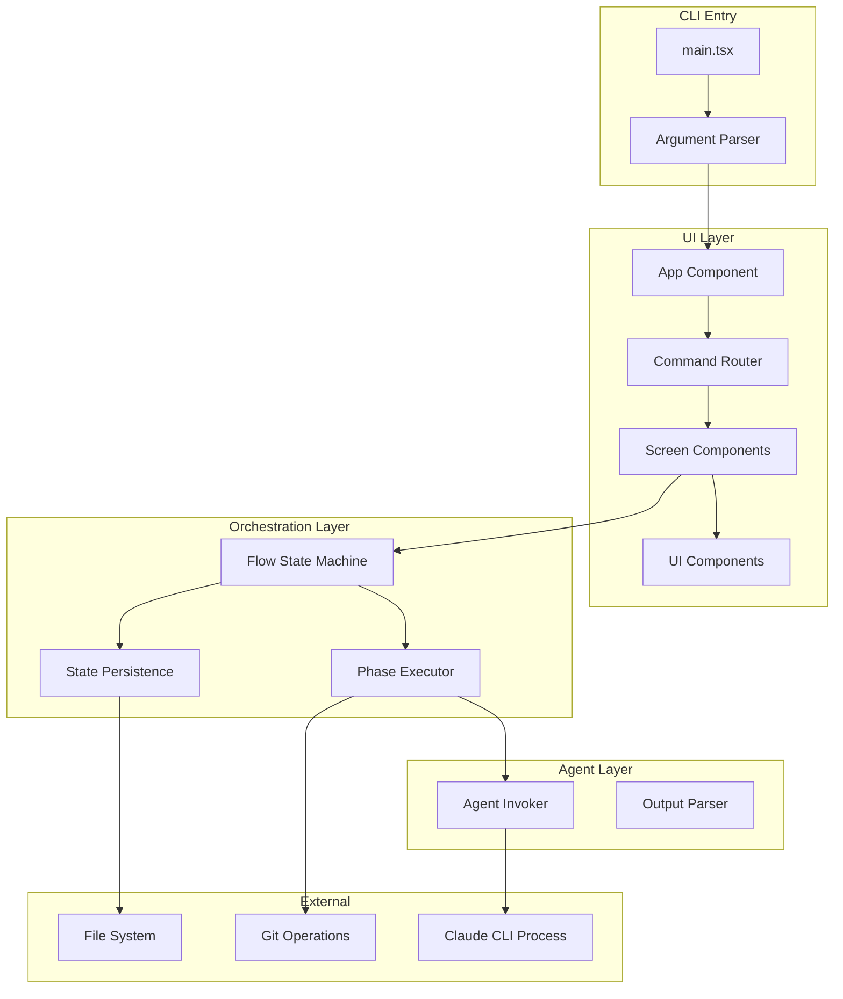
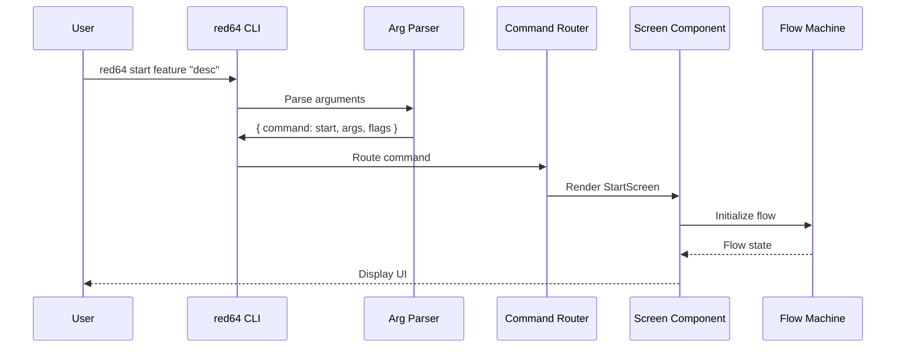
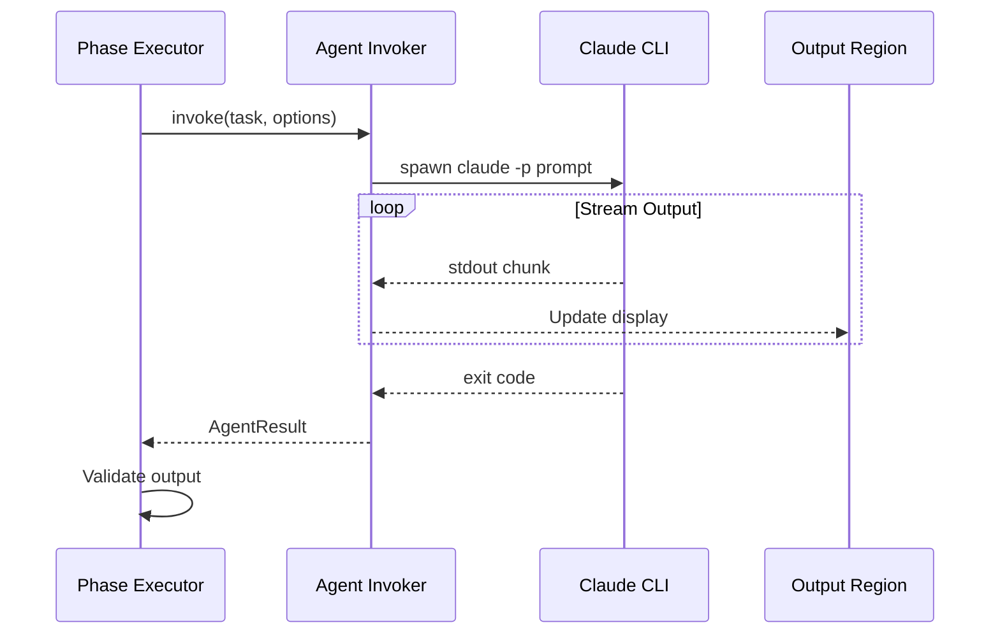
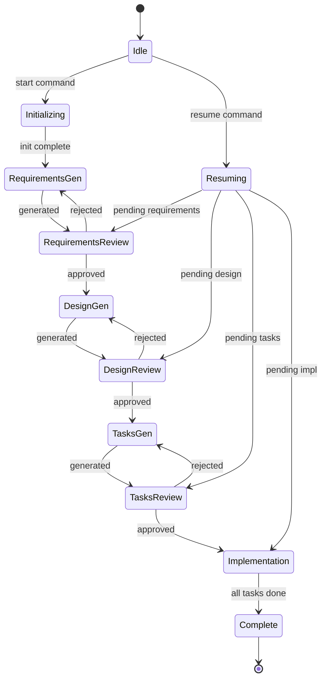

# Technical Design Document: red64-cli-scaffold

## Overview

**Purpose**: This feature establishes the foundational CLI scaffold for red64-cli, enabling developers to orchestrate spec-driven development workflows from the terminal with deterministic TypeScript control and scoped AI agent invocation.

**Users**: Developers will utilize red64-cli to bootstrap projects, manage feature development flows, and interact with AI-generated specifications through a polished terminal interface.

**Impact**: Creates the core application architecture upon which all subsequent red64 features (init, flow-core, flow-management) will build.

### Goals
- Establish Ink-based terminal UI foundation with React-like component architecture
- Implement deterministic TypeScript state machine for workflow orchestration
- Define clean AgentInvoker interface for scoped Claude CLI invocation
- Provide complete command structure with argument parsing
- Deliver polished terminal UI with colors, spinners, and interactive elements

### Non-Goals
- Full workflow phase implementation (deferred to red64-flow-core spec)
- Project initialization logic (deferred to red64-init spec)
- Flow management commands (list, status, abort) implementation details (deferred to red64-flow-management spec)
- Multi-tier Claude configuration management (basic --tier support only)

## Architecture

### Architecture Pattern & Boundary Map

The architecture follows a layered component pattern with clear separation between UI, orchestration, and external process invocation:



**Architecture Integration**:
- Selected pattern: Layered architecture with command routing
- Domain/feature boundaries: UI layer isolated from orchestration; agent invocation encapsulated
- Existing patterns preserved: React component patterns per ink.md steering
- New components rationale: Each layer has single responsibility and testable interfaces
- Steering compliance: Follows Ink patterns from `.kiro/steering/ink.md`

### Technology Stack

| Layer | Choice / Version | Role in Feature | Notes |
|-------|------------------|-----------------|-------|
| CLI Framework | Ink 5.x | Terminal UI rendering with React components | Core framework |
| UI Components | @inkjs/ui 2.x | Spinner, Select, ConfirmInput, ProgressBar | Official Ink component library |
| Argument Parsing | meow 14.x | CLI argument and flag parsing | Zero dependencies |
| Runtime | Node.js 20+ | JavaScript runtime | LTS version |
| Language | TypeScript 5.x | Type-safe development | Strict mode enabled |
| Build | tsx | TypeScript execution | Development and production |

## System Flows

### Command Execution Flow



### Agent Invocation Flow



### Flow State Transitions



## Requirements Traceability

| Requirement | Summary | Components | Interfaces | Flows |
|-------------|---------|------------|------------|-------|
| 1.1-1.7 | Deterministic orchestration | FlowStateMachine, PhaseExecutor, StateStore | FlowMachineService, StateStoreService | State Transitions |
| 2.1-2.6 | Scoped agent invocation | AgentInvoker, OutputParser | AgentInvokerService | Agent Invocation |
| 3.1-3.5 | CLI bootstrap | Main, ArgParser, App | CLI entry types | Command Execution |
| 4.1-4.7 | Command structure | CommandRouter, Screen components | CommandHandler interface | Command Execution |
| 5.1-5.5 | Global options | ArgParser, GlobalConfig | FlagDefinitions | Command Execution |
| 6.1-6.6 | Terminal UI | UIComponents (Spinner, StatusLine, etc.) | Component props | All flows |
| 7.1-7.7 | Agent interface | AgentInvoker, OutputRegion | AgentInvokerService | Agent Invocation |
| 8.1-8.5 | Branding | All components | N/A | N/A |

## Components and Interfaces

| Component | Domain/Layer | Intent | Req Coverage | Key Dependencies (P0/P1) | Contracts |
|-----------|--------------|--------|--------------|--------------------------|-----------|
| Main | Entry | CLI entry point, argument parsing | 3.1-3.5, 5.1-5.5 | meow (P0) | Service |
| App | UI | Root React component | 3.3 | Ink render (P0) | State |
| CommandRouter | UI | Route commands to screens | 4.1-4.7 | App (P0) | Service |
| FlowStateMachine | Orchestration | Deterministic state transitions | 1.1-1.7 | StateStore (P0) | Service, State |
| PhaseExecutor | Orchestration | Execute workflow phases | 1.1, 2.1-2.6 | AgentInvoker (P0), FlowStateMachine (P1) | Service |
| StateStore | Orchestration | Persist/restore flow state | 1.5, 1.7 | FileSystem (P0) | Service |
| AgentInvoker | Agent | Spawn and manage Claude CLI | 7.1-7.7, 2.1-2.6 | child_process (P0) | Service |
| Spinner | UI | Loading indicator | 6.2 | @inkjs/ui (P0) | - |
| StatusLine | UI | Status display with color | 6.1 | Ink primitives (P0) | - |
| SelectMenu | UI | Interactive selection | 6.5, 6.6 | @inkjs/ui (P0) | - |
| OutputRegion | UI | Agent output display | 7.7 | Ink Box/Text (P0) | State |

### Entry Layer

#### Main (cli.tsx)

| Field | Detail |
|-------|--------|
| Intent | CLI entry point: parse arguments, configure global options, render App |
| Requirements | 3.1, 3.2, 3.4, 5.1-5.5 |

**Responsibilities & Constraints**
- Parse CLI arguments using meow
- Extract command and positional arguments
- Configure global flags into GlobalConfig
- Initialize Ink render with App component

**Dependencies**
- External: meow 14.x - argument parsing (P0)
- External: ink - render function (P0)
- Outbound: App - root component (P0)

**Contracts**: Service [x] / API [ ] / Event [ ] / Batch [ ] / State [ ]

##### Service Interface
```typescript
interface CLIConfig {
  readonly command: Command;
  readonly args: readonly string[];
  readonly flags: GlobalFlags;
}

interface GlobalFlags {
  readonly skipPermissions: boolean;
  readonly brownfield: boolean;
  readonly greenfield: boolean;
  readonly tier: string | undefined;
  readonly help: boolean;
  readonly version: boolean;
}

type Command =
  | 'init'
  | 'start'
  | 'resume'
  | 'status'
  | 'list'
  | 'abort'
  | 'help'
  | undefined;

// Entry function
function main(): void;
```
- Preconditions: Process started with valid Node.js environment
- Postconditions: Ink app rendered or help/version displayed and exited
- Invariants: GlobalFlags immutable after parsing

**Implementation Notes**
- Integration: meow importMeta required for ESM compatibility
- Validation: Validate --tier has value when provided; show error if missing
- Risks: None significant

### UI Layer

#### App

| Field | Detail |
|-------|--------|
| Intent | Root React component providing global context and error boundary |
| Requirements | 3.3 |

**Responsibilities & Constraints**
- Provide GlobalConfig context to child components
- Wrap children in error boundary
- Handle graceful exit via useApp hook

**Dependencies**
- Inbound: Main - receives CLIConfig (P0)
- Outbound: CommandRouter - routes to screens (P0)
- External: ink - useApp, Box, Text (P0)

**Contracts**: Service [ ] / API [ ] / Event [ ] / Batch [ ] / State [x]

##### State Management
- State model: GlobalConfig context, error state
- Persistence: None (session only)
- Concurrency: Single-threaded React rendering

**Implementation Notes**
- Integration: Wrap CommandRouter in GlobalConfigProvider
- Validation: Error boundary catches and displays component errors
- Risks: None

#### CommandRouter

| Field | Detail |
|-------|--------|
| Intent | Route parsed command to appropriate screen component |
| Requirements | 4.1-4.7 |

**Responsibilities & Constraints**
- Map command string to screen component
- Pass args and flags to screen
- Handle unknown commands with help display

**Dependencies**
- Inbound: App - receives command, args, flags (P0)
- Outbound: Screen components - renders appropriate screen (P0)

**Contracts**: Service [x] / API [ ] / Event [ ] / Batch [ ] / State [ ]

##### Service Interface
```typescript
interface CommandRouterProps {
  readonly command: Command;
  readonly args: readonly string[];
  readonly flags: GlobalFlags;
}

// Renders appropriate screen based on command
const CommandRouter: FC<CommandRouterProps>;
```
- Preconditions: Valid Command type
- Postconditions: Appropriate screen rendered
- Invariants: Unknown commands route to HelpScreen

**Implementation Notes**
- Integration: Switch on command, render corresponding Screen
- Validation: None - type system ensures valid commands
- Risks: None

#### Screen Components (Summary)

Screen components handle individual commands. Each screen is a React functional component.

| Screen | Command | Responsibilities |
|--------|---------|------------------|
| InitScreen | init | Bootstrap project, display progress |
| StartScreen | start | Create flow, begin spec-init phase |
| ResumeScreen | resume | Load state, continue flow |
| StatusScreen | status | Display flow status |
| ListScreen | list | Show all active flows |
| AbortScreen | abort | Confirm and cleanup flow |
| HelpScreen | help | Display usage information |

**Implementation Notes**
- All screens receive args and flags via props
- Screens use FlowStateMachine for workflow operations
- Interactive screens use SelectMenu for approval gates

### Orchestration Layer

#### FlowStateMachine

| Field | Detail |
|-------|--------|
| Intent | Deterministic TypeScript state machine controlling all phase transitions |
| Requirements | 1.1-1.4, 1.6, 1.7 |

**Responsibilities & Constraints**
- Define all valid flow phases as discriminated union
- Implement pure transition function (currentPhase, event) => nextPhase
- Never consult agent for transition decisions
- Manage HITL approval gates as state transitions

**Dependencies**
- Inbound: Screen components - send events (P0)
- Outbound: StateStore - persist state changes (P0)
- Outbound: PhaseExecutor - trigger phase execution (P1)

**Contracts**: Service [x] / API [ ] / Event [ ] / Batch [ ] / State [x]

##### Service Interface
```typescript
type FlowPhase =
  | { type: 'idle' }
  | { type: 'initializing'; feature: string; description: string }
  | { type: 'requirements-generating'; feature: string }
  | { type: 'requirements-review'; feature: string }
  | { type: 'design-generating'; feature: string }
  | { type: 'design-review'; feature: string }
  | { type: 'tasks-generating'; feature: string }
  | { type: 'tasks-review'; feature: string }
  | { type: 'implementing'; feature: string; currentTask: number; totalTasks: number }
  | { type: 'complete'; feature: string }
  | { type: 'aborted'; feature: string; reason: string }
  | { type: 'error'; feature: string; error: string };

type FlowEvent =
  | { type: 'START'; feature: string; description: string }
  | { type: 'RESUME'; feature: string }
  | { type: 'PHASE_COMPLETE' }
  | { type: 'APPROVE' }
  | { type: 'REJECT' }
  | { type: 'ABORT'; reason: string }
  | { type: 'ERROR'; error: string };

interface FlowMachineService {
  getPhase(): FlowPhase;
  send(event: FlowEvent): FlowPhase;
  canTransition(event: FlowEvent): boolean;
}

function createFlowMachine(initialPhase?: FlowPhase): FlowMachineService;
```
- Preconditions: Valid FlowEvent for current phase
- Postconditions: Phase transitioned deterministically; state persisted
- Invariants: Transition function is pure; no side effects in transition logic

##### State Management
- State model: FlowPhase discriminated union
- Persistence: JSON serialization via StateStore
- Concurrency: Single flow active per feature

**Implementation Notes**
- Integration: Pure function transitions; side effects in PhaseExecutor
- Validation: canTransition checks valid transitions before send
- Risks: State corruption if persistence fails mid-transition

#### PhaseExecutor

| Field | Detail |
|-------|--------|
| Intent | Execute phase-specific operations including agent invocation |
| Requirements | 1.1, 2.1-2.6 |

**Responsibilities & Constraints**
- Map phases to executable operations
- Invoke AgentInvoker for generation phases
- Execute git operations directly (not via agent)
- Handle retry/recovery in TypeScript code

**Dependencies**
- Inbound: FlowStateMachine - triggered on phase entry (P0)
- Outbound: AgentInvoker - for generation tasks (P0)
- External: Git - direct git operations (P1)
- External: FileSystem - file I/O (P1)

**Contracts**: Service [x] / API [ ] / Event [ ] / Batch [ ] / State [ ]

##### Service Interface
```typescript
interface PhaseExecutionResult {
  readonly success: boolean;
  readonly output: string | undefined;
  readonly error: string | undefined;
}

interface PhaseExecutorService {
  execute(phase: FlowPhase, config: GlobalFlags): Promise<PhaseExecutionResult>;
}

function createPhaseExecutor(
  agentInvoker: AgentInvokerService,
  stateStore: StateStoreService
): PhaseExecutorService;
```
- Preconditions: Valid phase with required context
- Postconditions: Phase operation completed or error returned
- Invariants: Never passes workflow state to agent; focused prompts only

**Implementation Notes**
- Integration: Phase-specific prompt templates; agent output validation
- Validation: Parse agent output before returning success
- Risks: Agent output may be malformed; implement retry with max attempts

#### StateStore

| Field | Detail |
|-------|--------|
| Intent | Persist and restore flow state through TypeScript file I/O |
| Requirements | 1.5, 1.7 |

**Responsibilities & Constraints**
- Serialize FlowPhase to JSON
- Write to .red64/flows/{feature}/state.json
- Atomic write pattern (temp file + rename)
- Validate state on load

**Dependencies**
- External: Node.js fs - file operations (P0)

**Contracts**: Service [x] / API [ ] / Event [ ] / Batch [ ] / State [ ]

##### Service Interface
```typescript
interface FlowState {
  readonly feature: string;
  readonly phase: FlowPhase;
  readonly createdAt: string;
  readonly updatedAt: string;
  readonly history: readonly FlowPhase[];
}

interface StateStoreService {
  save(state: FlowState): Promise<void>;
  load(feature: string): Promise<FlowState | undefined>;
  list(): Promise<readonly FlowState[]>;
  delete(feature: string): Promise<void>;
  exists(feature: string): Promise<boolean>;
}

function createStateStore(baseDir: string): StateStoreService;
```
- Preconditions: baseDir exists and is writable
- Postconditions: State persisted atomically
- Invariants: Corrupted state files rejected on load

**Implementation Notes**
- Integration: Use .red64/flows/ directory structure
- Validation: JSON schema validation on load; reject invalid states
- Risks: Concurrent writes; use file locking or atomic rename

### Agent Layer

#### AgentInvoker

| Field | Detail |
|-------|--------|
| Intent | Wrap Claude CLI execution as typed TypeScript interface |
| Requirements | 7.1-7.7, 2.1-2.6 |

**Responsibilities & Constraints**
- Spawn Claude CLI as child process
- Pass skip-permissions flag if configured
- Set CLAUDE_CONFIG_DIR for tier selection
- Stream stdout/stderr to UI
- Return typed result with success/failure

**Dependencies**
- External: Node.js child_process - spawn (P0)
- Outbound: OutputRegion - stream output display (P1)

**Contracts**: Service [x] / API [ ] / Event [ ] / Batch [ ] / State [ ]

##### Service Interface
```typescript
interface AgentInvokeOptions {
  readonly prompt: string;
  readonly workingDirectory: string;
  readonly skipPermissions: boolean;
  readonly tier: string | undefined;
  readonly onOutput?: (chunk: string) => void;
  readonly onError?: (chunk: string) => void;
  readonly timeout?: number;
}

interface AgentResult {
  readonly success: boolean;
  readonly exitCode: number;
  readonly stdout: string;
  readonly stderr: string;
  readonly timedOut: boolean;
}

interface AgentInvokerService {
  invoke(options: AgentInvokeOptions): Promise<AgentResult>;
  abort(): void;
}

function createAgentInvoker(): AgentInvokerService;
```
- Preconditions: Claude CLI installed and accessible in PATH
- Postconditions: AgentResult returned with complete output
- Invariants: Never passes workflow state; prompt is task-focused only

**Implementation Notes**
- Integration: spawn('claude', ['-p', prompt, ...flags])
- Validation: Check exitCode; non-zero indicates failure
- Risks: Claude CLI not installed; check on startup

### UI Components (Summary)

UI components follow Ink patterns from steering. Most use @inkjs/ui.

| Component | Props Interface | Notes |
|-----------|-----------------|-------|
| Spinner | `{ label: string }` | From @inkjs/ui |
| StatusLine | `{ label: string; status: Status; message?: string }` | Custom, color-coded |
| ProgressBar | `{ current: number; total: number; label: string }` | From @inkjs/ui |
| SelectMenu | `{ items: Item[]; onSelect: (item) => void }` | From @inkjs/ui or ink-select-input |
| OutputRegion | `{ lines: string[]; maxHeight?: number }` | Custom, scrollable |
| Header | `{ title: string }` | Box-drawing characters |

**Base UI Props**
```typescript
type Status = 'pending' | 'running' | 'success' | 'error' | 'warning';

interface StatusLineProps {
  readonly label: string;
  readonly status: Status;
  readonly message?: string;
}

interface SelectMenuItem<T = string> {
  readonly label: string;
  readonly value: T;
}

interface SelectMenuProps<T = string> {
  readonly items: readonly SelectMenuItem<T>[];
  readonly onSelect: (item: SelectMenuItem<T>) => void;
}

interface OutputRegionProps {
  readonly lines: readonly string[];
  readonly maxHeight?: number;
  readonly title?: string;
}
```

**Implementation Notes**
- Colors: green (success), red (error), yellow (pending/warning), cyan (info)
- Box-drawing: Header component uses Unicode box characters
- Keyboard: useInput hook for navigation and quit handling

## Data Models

### Domain Model

**Aggregates**:
- Flow: Root aggregate containing phase, feature metadata, history
- GlobalConfig: Session configuration from CLI flags

**Entities**:
- FlowState: Persisted flow with phase and timestamps
- AgentResult: Output from single agent invocation

**Value Objects**:
- FlowPhase: Discriminated union of all possible phases
- FlowEvent: Discriminated union of all valid events
- GlobalFlags: Immutable flag configuration

**Domain Events**:
- PhaseTransitioned: Flow moved to new phase
- AgentInvoked: Agent task started
- AgentCompleted: Agent task finished
- FlowCompleted: All phases done
- FlowAborted: Flow cancelled by user

**Invariants**:
- Flow must have unique feature name
- Phase transitions must follow state machine rules
- Agent invocation only in generation phases

### Logical Data Model

**FlowState Structure**:
```typescript
interface FlowState {
  feature: string;           // Unique identifier
  phase: FlowPhase;          // Current phase (discriminated union)
  createdAt: string;         // ISO 8601 timestamp
  updatedAt: string;         // ISO 8601 timestamp
  history: FlowPhase[];      // Ordered list of past phases
  metadata: {
    description: string;     // Feature description
    mode: 'greenfield' | 'brownfield';
    tier?: string;
  };
}
```

**Storage Location**: `.red64/flows/{feature}/state.json`

**Consistency**:
- Single writer (one CLI process per flow)
- Atomic writes via temp file + rename
- Validate schema on load

## Error Handling

### Error Strategy

Errors are categorized and handled at appropriate layers with typed error responses.

### Error Categories and Responses

**User Errors**:
- Invalid command: Display help with available commands
- Missing arguments: Show command-specific usage
- Invalid tier: "Error: --tier requires a value"

**System Errors**:
- Claude CLI not found: "Error: Claude CLI not installed. Install with: npm install -g @anthropic-ai/claude-cli"
- File system errors: Graceful message with path; suggest permissions check
- State corruption: "Error: Flow state corrupted. Use 'red64 abort {feature}' to reset."

**Agent Errors**:
- Agent timeout: Retry up to 3 times with backoff; then fail with message
- Invalid output: Log output; retry once; then fail and prompt manual intervention
- Non-zero exit: Display stderr; offer retry or abort

### Monitoring
- Log all agent invocations with timestamps
- Log phase transitions
- Store error history in flow state for debugging

## Testing Strategy

### Unit Tests
- FlowStateMachine: All valid transitions; invalid transition rejection; state serialization
- ArgParser: Flag parsing; command extraction; error cases
- StateStore: Save/load roundtrip; corruption handling; atomic write verification
- AgentInvoker: Mock spawn; output streaming; timeout handling

### Integration Tests
- Full command execution: start -> generate -> review -> complete
- Resume flow: Load persisted state; continue from correct phase
- Error recovery: Agent failure -> retry -> success/abort

### E2E/UI Tests
- Spinner renders during async operations
- SelectMenu navigates with arrow keys
- StatusLine displays correct colors
- OutputRegion scrolls with content

### Component Tests (Ink)
- Use ink-testing-library for component rendering
- Verify lastFrame() contains expected text
- Simulate keyboard input with stdin.write()

## Security Considerations

- **Process Execution**: Claude CLI spawned with minimal privileges; no shell: true
- **File Permissions**: State files created with user-only permissions (0600)
- **Input Sanitization**: Feature names sanitized to prevent path traversal
- **Environment Variables**: Only CLAUDE_CONFIG_DIR passed; no sensitive data in env

## Supporting References

### Project Structure
```
src/
  cli.tsx                 # Entry point with meow + render
  App.tsx                 # Root component
  components/
    CommandRouter.tsx
    screens/
      InitScreen.tsx
      StartScreen.tsx
      ResumeScreen.tsx
      StatusScreen.tsx
      ListScreen.tsx
      AbortScreen.tsx
      HelpScreen.tsx
    ui/
      Spinner.tsx         # Re-export from @inkjs/ui
      StatusLine.tsx
      ProgressBar.tsx
      SelectMenu.tsx
      OutputRegion.tsx
      Header.tsx
  services/
    FlowStateMachine.ts
    PhaseExecutor.ts
    StateStore.ts
    AgentInvoker.ts
  types/
    index.ts              # All type definitions
  utils/
    git.ts                # Git operations
    paths.ts              # Path utilities
```

### Command Usage Reference
```
Red64 Flow Orchestrator

Usage:
  red64 init                           Bootstrap project for red64 flows
  red64 start <feature> "<desc>"       Start new feature flow
  red64 resume <feature>               Resume paused/interrupted flow
  red64 status [feature]               Show flow status
  red64 list                           List all active flows
  red64 abort <feature>                Abort and cleanup flow
  red64 help                           Show this help

Global Options:
  -s, --skip-permissions    Pass skip-permissions to Claude CLI
  -b, --brownfield          Enable brownfield mode (gap analysis)
  -g, --greenfield          Greenfield mode (default)
  -t, --tier <name>         Use specified Claude config directory
  -h, --help                Show help
  -v, --version             Show version
```
