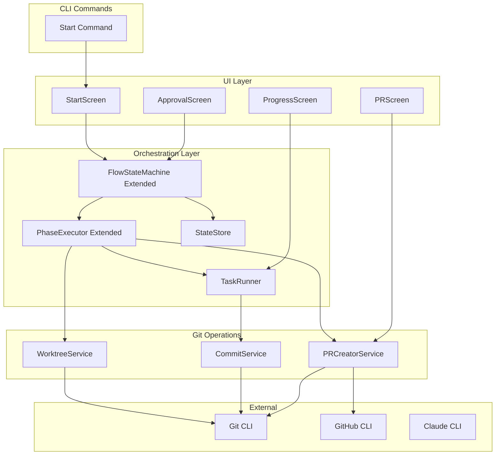
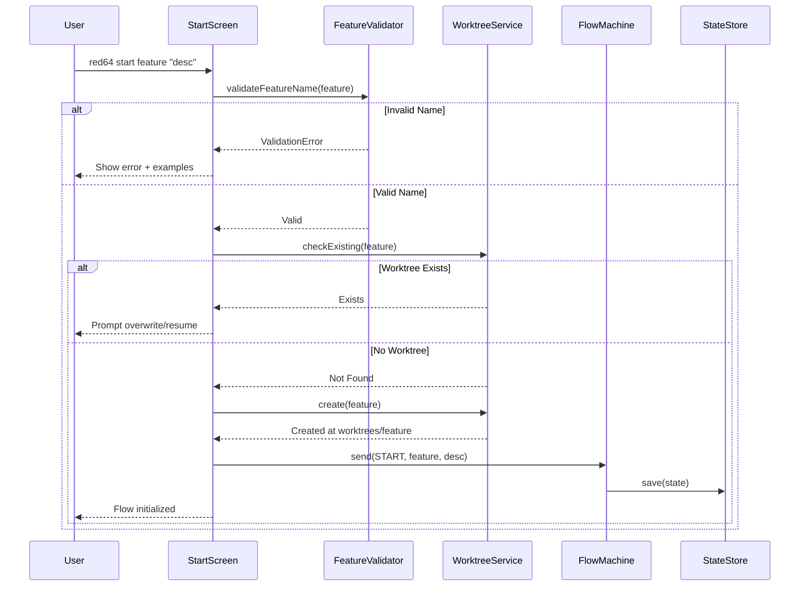
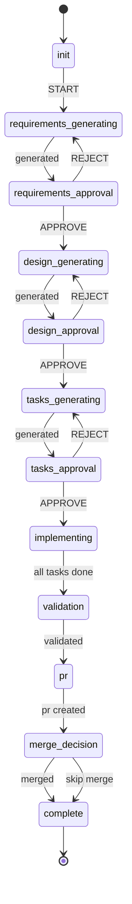
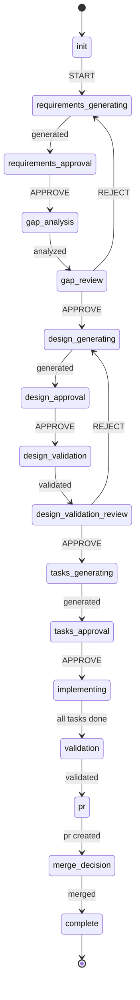
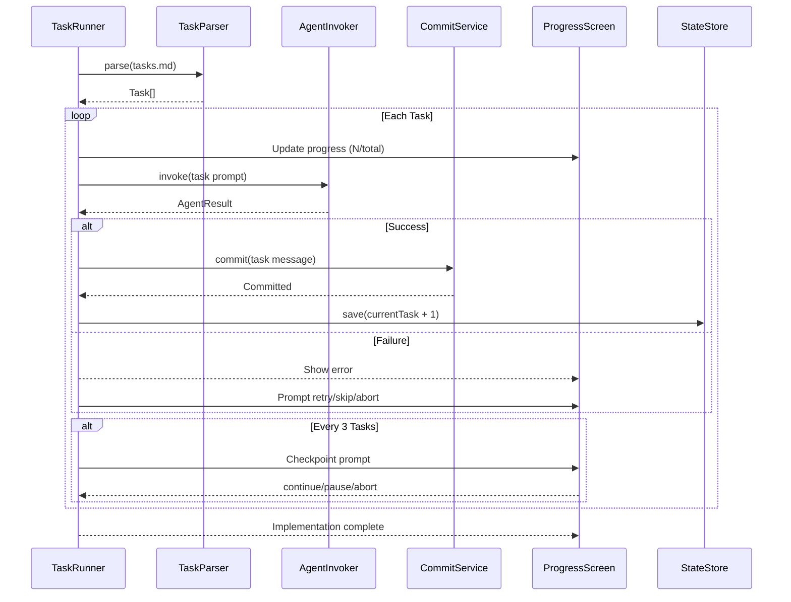

# Technical Design Document: red64-flow-core

## Overview

**Purpose**: This feature delivers core workflow functionality for red64-cli, enabling developers to orchestrate complete feature development flows from initialization through PR creation with isolated git worktrees.

**Users**: Developers will utilize the `red64 start` command to initiate feature flows, progress through requirements/design/tasks phases with HITL approval gates, execute incremental implementation, and create pull requests.

**Impact**: Extends the scaffold foundation with full workflow execution, replacing placeholder implementations with production-ready state machine, git operations, task execution, and PR creation.

### Goals
- Implement `start` command with feature validation and worktree creation
- Extend state machine with greenfield and brownfield phase sequences
- Execute implementation tasks incrementally with checkpoints and commits
- Create well-formatted PRs with spec artifact links
- Maintain deterministic TypeScript control over all workflow phases

### Non-Goals
- Multi-repository workflows (single repo focus)
- Parallel task execution (sequential only)
- Custom PR templates (standard format only)
- Branch protection rule configuration

## Architecture

### Existing Architecture Analysis

The scaffold provides foundational components that this feature extends:
- **FlowStateMachine**: Pure transition function with basic greenfield phases
- **StateStore**: Atomic persistence to `.red64/flows/{feature}/state.json`
- **AgentInvoker**: Claude CLI wrapper with streaming output
- **PhaseExecutor**: Phase-to-prompt mapping with retry logic
- **Git utilities**: Placeholder functions requiring implementation
- **StartScreen**: Shell component needing workflow integration

Key patterns preserved:
- Discriminated unions for type-safe phase/event handling
- Service factory functions for dependency injection
- React component patterns per Ink steering

### Architecture Pattern & Boundary Map



**Architecture Integration**:
- Selected pattern: Extension of existing layered architecture
- Domain/feature boundaries: Git operations isolated in services; UI screens decoupled from business logic
- Existing patterns preserved: Service factory functions, discriminated unions, StateStore persistence
- New components rationale: TaskRunner encapsulates incremental execution; Git services wrap CLI operations
- Steering compliance: Follows Ink patterns from `.kiro/steering/ink.md`

### Technology Stack

| Layer | Choice / Version | Role in Feature | Notes |
|-------|------------------|-----------------|-------|
| CLI Framework | Ink 5.x | Terminal UI for approval gates, progress display | Existing |
| Git Operations | Git CLI (system) | Worktree, commit, push, branch operations | Via spawn() |
| PR Creation | GitHub CLI (gh) | Create and merge pull requests | Via spawn() |
| State Machine | TypeScript unions | Extended phase definitions for greenfield/brownfield | Extends scaffold |
| Task Parsing | Regex | Extract tasks from tasks.md | Lightweight, no deps |

## System Flows

### Start Command Flow



### Greenfield Phase Sequence



### Brownfield Phase Sequence



### Implementation Phase Flow



## Requirements Traceability

| Requirement | Summary | Components | Interfaces | Flows |
|-------------|---------|------------|------------|-------|
| 1.1-1.2 | Feature name validation | FeatureValidator | validateFeatureName() | Start Command |
| 1.3-1.4 | Worktree creation | WorktreeService | create(), check() | Start Command |
| 1.5-1.6 | Flow state persistence | StateStore (extended) | save(), commit tracking | All flows |
| 2.1-2.6 | State machine phases | FlowStateMachine | FlowPhase union, transition() | Phase Sequences |
| 3.1-3.7 | Greenfield workflow | FlowStateMachine, ApprovalScreen | GREENFIELD_PHASES | Greenfield Sequence |
| 4.1-4.5 | Brownfield workflow | FlowStateMachine, ApprovalScreen | BROWNFIELD_PHASES | Brownfield Sequence |
| 5.1-5.7 | Implementation phase | TaskRunner, TaskParser | parse(), execute() | Implementation Flow |
| 6.1-6.6 | PR creation | PRCreatorService | create(), merge() | PR Flow |

## Components and Interfaces

| Component | Domain/Layer | Intent | Req Coverage | Key Dependencies (P0/P1) | Contracts |
|-----------|--------------|--------|--------------|--------------------------|-----------|
| FeatureValidator | Orchestration | Validate feature name format | 1.1, 1.2 | None | Service |
| WorktreeService | Git | Create and manage git worktrees | 1.3, 1.4 | Git CLI (P0) | Service |
| FlowStateMachine (ext) | Orchestration | Extended phases for both modes | 2.1-2.6, 3.1-3.7, 4.1-4.5 | StateStore (P0) | Service, State |
| TaskParser | Orchestration | Parse tasks.md for task list | 5.1 | FileSystem (P0) | Service |
| TaskRunner | Orchestration | Execute tasks incrementally | 5.2-5.7 | AgentInvoker (P0), CommitService (P1) | Service |
| CommitService | Git | Stage and commit changes | 5.3, 5.7 | Git CLI (P0) | Service |
| PRCreatorService | Git | Create and merge pull requests | 6.1-6.6 | Git CLI (P0), GitHub CLI (P0) | Service |
| StartScreen (impl) | UI | Full start command workflow | 1.1-1.6 | FlowMachine (P0), WorktreeService (P0) | State |
| ApprovalScreen | UI | HITL approval gate rendering | 3.2-3.7, 4.3-4.5 | FlowMachine (P0) | State |
| ProgressScreen | UI | Task progress display | 5.4-5.5 | TaskRunner (P0) | State |

### Orchestration Layer

#### FeatureValidator

| Field | Detail |
|-------|--------|
| Intent | Validate feature name format: lowercase, starts with letter, alphanumeric with hyphens |
| Requirements | 1.1, 1.2 |

**Responsibilities & Constraints**
- Validate feature name matches pattern: `^[a-z][a-z0-9-]*$`
- Return validation result with error message if invalid
- Provide format examples in error

**Dependencies**
- None (pure validation)

**Contracts**: Service [x] / API [ ] / Event [ ] / Batch [ ] / State [ ]

##### Service Interface
```typescript
interface ValidationResult {
  readonly valid: boolean;
  readonly error: string | undefined;
}

interface FeatureValidatorService {
  validate(featureName: string): ValidationResult;
}

function createFeatureValidator(): FeatureValidatorService;
```
- Preconditions: Non-empty string input
- Postconditions: Valid result or error with explanation
- Invariants: Pattern is fixed; no configuration

**Implementation Notes**
- Validation: Regex `^[a-z][a-z0-9-]*$`
- Error examples: "Feature name must start with lowercase letter (e.g., 'my-feature', 'auth2')"

#### FlowStateMachine (Extended)

| Field | Detail |
|-------|--------|
| Intent | Extended state machine with greenfield/brownfield phase sequences and brownfield-specific phases |
| Requirements | 2.1-2.6, 3.1-3.7, 4.1-4.5 |

**Responsibilities & Constraints**
- Define extended FlowPhase union with brownfield phases
- Implement mode-aware transition function
- Validate transitions based on workflow mode
- Emit state change for UI subscription

**Dependencies**
- Inbound: Screen components - send events (P0)
- Outbound: StateStore - persist state changes (P0)

**Contracts**: Service [x] / API [ ] / Event [ ] / Batch [ ] / State [x]

##### Service Interface
```typescript
// Extended FlowPhase with brownfield phases
type FlowPhase =
  | { type: 'idle' }
  | { type: 'initializing'; feature: string; description: string }
  | { type: 'requirements-generating'; feature: string }
  | { type: 'requirements-approval'; feature: string }
  | { type: 'gap-analysis'; feature: string }           // Brownfield only
  | { type: 'gap-review'; feature: string }             // Brownfield only
  | { type: 'design-generating'; feature: string }
  | { type: 'design-approval'; feature: string }
  | { type: 'design-validation'; feature: string }      // Brownfield only
  | { type: 'design-validation-review'; feature: string } // Brownfield only
  | { type: 'tasks-generating'; feature: string }
  | { type: 'tasks-approval'; feature: string }
  | { type: 'implementing'; feature: string; currentTask: number; totalTasks: number }
  | { type: 'paused'; feature: string; pausedAt: number; totalTasks: number }
  | { type: 'validation'; feature: string }
  | { type: 'pr'; feature: string }
  | { type: 'merge-decision'; feature: string; prUrl: string }
  | { type: 'complete'; feature: string }
  | { type: 'aborted'; feature: string; reason: string }
  | { type: 'error'; feature: string; error: string };

// Extended FlowEvent
type FlowEvent =
  | { type: 'START'; feature: string; description: string; mode: WorkflowMode }
  | { type: 'RESUME'; feature: string }
  | { type: 'PHASE_COMPLETE' }
  | { type: 'PHASE_COMPLETE_WITH_DATA'; data: Record<string, unknown> }
  | { type: 'APPROVE' }
  | { type: 'REJECT' }
  | { type: 'PAUSE' }
  | { type: 'ABORT'; reason: string }
  | { type: 'ERROR'; error: string }
  | { type: 'TASK_COMPLETE'; taskIndex: number }
  | { type: 'PR_CREATED'; prUrl: string }
  | { type: 'MERGE' }
  | { type: 'SKIP_MERGE' };

type WorkflowMode = 'greenfield' | 'brownfield';

// Phase sequence constants
const GREENFIELD_PHASES: readonly FlowPhase['type'][] = [
  'initializing',
  'requirements-generating',
  'requirements-approval',
  'design-generating',
  'design-approval',
  'tasks-generating',
  'tasks-approval',
  'implementing',
  'validation',
  'pr',
  'merge-decision',
  'complete'
];

const BROWNFIELD_PHASES: readonly FlowPhase['type'][] = [
  'initializing',
  'requirements-generating',
  'requirements-approval',
  'gap-analysis',
  'gap-review',
  'design-generating',
  'design-approval',
  'design-validation',
  'design-validation-review',
  'tasks-generating',
  'tasks-approval',
  'implementing',
  'validation',
  'pr',
  'merge-decision',
  'complete'
];

interface FlowMachineService {
  getPhase(): FlowPhase;
  getMode(): WorkflowMode;
  send(event: FlowEvent): FlowPhase;
  canTransition(event: FlowEvent): boolean;
  subscribe(listener: (phase: FlowPhase) => void): () => void;
}
```
- Preconditions: Valid FlowEvent for current phase and mode
- Postconditions: Phase transitioned deterministically; subscribers notified
- Invariants: Transition function is pure; mode determines valid phase sequence

##### State Management
- State model: FlowPhase with mode-aware transitions
- Persistence: FlowState with metadata.mode
- Concurrency: Single flow per feature; subscription for UI updates

**Implementation Notes**
- Integration: Use mode from metadata to select phase sequence
- Validation: canTransition checks phase is in mode's sequence
- Risks: Mode change mid-flow undefined; lock mode at START

#### TaskParser

| Field | Detail |
|-------|--------|
| Intent | Parse tasks.md to extract ordered task list with titles and completion status |
| Requirements | 5.1 |

**Responsibilities & Constraints**
- Read tasks.md from spec directory
- Extract tasks with ID, title, description
- Track completion status from checkbox markers
- Return ordered Task array

**Dependencies**
- External: FileSystem - read tasks.md (P0)

**Contracts**: Service [x] / API [ ] / Event [ ] / Batch [ ] / State [ ]

##### Service Interface
```typescript
interface Task {
  readonly id: number;
  readonly title: string;
  readonly description: string;
  readonly completed: boolean;
}

interface TaskParserService {
  parse(specDir: string): Promise<readonly Task[]>;
}

function createTaskParser(): TaskParserService;
```
- Preconditions: tasks.md exists and is readable
- Postconditions: Ordered Task array or empty if no tasks found
- Invariants: Task IDs are sequential starting from 1

**Implementation Notes**
- Pattern: `## Task (\d+): (.+)` for task headers
- Completion: Look for `- [x]` vs `- [ ]` in task body
- Risks: Non-standard format; return empty with warning

#### TaskRunner

| Field | Detail |
|-------|--------|
| Intent | Execute implementation tasks sequentially with progress tracking, commits, and checkpoints |
| Requirements | 5.2-5.7 |

**Responsibilities & Constraints**
- Execute tasks in order via AgentInvoker
- Commit after each successful task
- Display progress (N of M)
- Checkpoint every 3 tasks with user prompt
- Support pause, resume, abort
- Generate meaningful commit messages

**Dependencies**
- Inbound: PhaseExecutor - triggered in implementing phase (P0)
- Outbound: AgentInvoker - invoke agent per task (P0)
- Outbound: CommitService - commit after task (P1)
- Outbound: StateStore - persist progress (P1)

**Contracts**: Service [x] / API [ ] / Event [ ] / Batch [ ] / State [x]

##### Service Interface
```typescript
interface TaskExecutionOptions {
  readonly feature: string;
  readonly specDir: string;
  readonly workingDir: string;
  readonly startFromTask: number;
  readonly onProgress: (current: number, total: number, task: Task) => void;
  readonly onCheckpoint: (current: number, total: number) => Promise<CheckpointDecision>;
  readonly flags: GlobalFlags;
}

type CheckpointDecision = 'continue' | 'pause' | 'abort';

interface TaskExecutionResult {
  readonly success: boolean;
  readonly completedTasks: number;
  readonly totalTasks: number;
  readonly pausedAt: number | undefined;
  readonly error: string | undefined;
}

interface TaskRunnerService {
  execute(options: TaskExecutionOptions): Promise<TaskExecutionResult>;
  abort(): void;
}

function createTaskRunner(
  agentInvoker: AgentInvokerService,
  commitService: CommitServiceInterface,
  taskParser: TaskParserService
): TaskRunnerService;
```
- Preconditions: tasks.md parsed successfully; working directory is worktree
- Postconditions: All tasks completed, or paused/aborted with state saved
- Invariants: Commits only after successful task completion; checkpoint at 3-task intervals

##### State Management
- State model: currentTask index in FlowPhase
- Persistence: Update StateStore after each task
- Concurrency: Single task at a time; abort flag for cancellation

**Implementation Notes**
- Commit message: `feat(<feature>): implement task <N> - <title>`
- Checkpoint: Prompt at tasks 3, 6, 9, etc.
- Resume: Start from pausedAt + 1

### Git Operations Layer

#### WorktreeService

| Field | Detail |
|-------|--------|
| Intent | Create, check, and remove git worktrees for feature isolation |
| Requirements | 1.3, 1.4 |

**Responsibilities & Constraints**
- Create worktree at `worktrees/<feature>` with branch `feature/<feature>`
- Check for existing worktree before creation
- Prompt user if worktree exists
- Remove worktree on abort/cleanup

**Dependencies**
- External: Git CLI - worktree commands (P0)

**Contracts**: Service [x] / API [ ] / Event [ ] / Batch [ ] / State [ ]

##### Service Interface
```typescript
interface WorktreeInfo {
  readonly path: string;
  readonly branch: string;
  readonly exists: boolean;
}

interface WorktreeResult {
  readonly success: boolean;
  readonly path: string | undefined;
  readonly error: string | undefined;
}

interface WorktreeServiceInterface {
  check(repoPath: string, feature: string): Promise<WorktreeInfo>;
  create(repoPath: string, feature: string): Promise<WorktreeResult>;
  remove(repoPath: string, feature: string, force?: boolean): Promise<WorktreeResult>;
  list(repoPath: string): Promise<readonly WorktreeInfo[]>;
}

function createWorktreeService(): WorktreeServiceInterface;
```
- Preconditions: repoPath is a git repository
- Postconditions: Worktree created/removed or error returned
- Invariants: Worktree path is always `worktrees/<feature>`; branch is `feature/<feature>`

**Implementation Notes**
- Create: `git worktree add -b feature/<feature> worktrees/<feature>`
- Check: `git worktree list --porcelain` and parse
- Remove: `git worktree remove worktrees/<feature>` with optional `--force`
- Risks: Git not installed; check and provide installation guidance

#### CommitService

| Field | Detail |
|-------|--------|
| Intent | Stage and commit changes with meaningful messages |
| Requirements | 5.3, 5.7, 1.6 |

**Responsibilities & Constraints**
- Stage all changes in working directory
- Create commit with formatted message
- Handle empty commits gracefully

**Dependencies**
- External: Git CLI - add, commit commands (P0)

**Contracts**: Service [x] / API [ ] / Event [ ] / Batch [ ] / State [ ]

##### Service Interface
```typescript
interface CommitResult {
  readonly success: boolean;
  readonly commitHash: string | undefined;
  readonly error: string | undefined;
}

interface CommitServiceInterface {
  stageAll(workingDir: string): Promise<CommitResult>;
  commit(workingDir: string, message: string): Promise<CommitResult>;
  stageAndCommit(workingDir: string, message: string): Promise<CommitResult>;
}

function createCommitService(): CommitServiceInterface;
```
- Preconditions: workingDir is a git repository or worktree
- Postconditions: Changes committed or error returned
- Invariants: Empty working directory results in no-op success

**Implementation Notes**
- Stage: `git add -A`
- Commit: `git commit -m "<message>"` with `--allow-empty` check
- Message format: `feat(<feature>): <summary>`

#### PRCreatorService

| Field | Detail |
|-------|--------|
| Intent | Push branch, create PR with spec artifacts, and optionally merge |
| Requirements | 6.1-6.6 |

**Responsibilities & Constraints**
- Push feature branch to remote
- Read spec artifacts to generate PR body
- Create PR using GitHub CLI
- Display PR URL to user
- Optionally squash-merge and delete branch

**Dependencies**
- External: Git CLI - push operations (P0)
- External: GitHub CLI (gh) - pr create, pr merge (P0)
- External: FileSystem - read spec artifacts (P1)

**Contracts**: Service [x] / API [ ] / Event [ ] / Batch [ ] / State [ ]

##### Service Interface
```typescript
interface PRCreateOptions {
  readonly workingDir: string;
  readonly feature: string;
  readonly specDir: string;
  readonly baseBranch: string;
}

interface PRCreateResult {
  readonly success: boolean;
  readonly prUrl: string | undefined;
  readonly prNumber: number | undefined;
  readonly error: string | undefined;
}

interface PRMergeOptions {
  readonly workingDir: string;
  readonly prNumber: number;
  readonly squash: boolean;
  readonly deleteBranch: boolean;
}

interface PRMergeResult {
  readonly success: boolean;
  readonly error: string | undefined;
}

interface PRCreatorServiceInterface {
  push(workingDir: string, remote?: string): Promise<CommitResult>;
  createPR(options: PRCreateOptions): Promise<PRCreateResult>;
  mergePR(options: PRMergeOptions): Promise<PRMergeResult>;
  generatePRBody(specDir: string, feature: string): Promise<string>;
}

function createPRCreatorService(): PRCreatorServiceInterface;
```
- Preconditions: Branch pushed; gh authenticated; spec artifacts exist
- Postconditions: PR created with URL, or merged with branch deleted
- Invariants: PR body always includes spec artifact links

**Implementation Notes**
- Push: `git push -u origin feature/<feature>`
- Create: `gh pr create --title "feat: <feature>" --body-file <generated>`
- Merge: `gh pr merge <number> --squash --delete-branch`
- Body format: Include requirements summary, design overview, task list, artifact links

##### PR Body Template
```markdown
## Feature: {feature}

### Summary
{requirements summary from requirements.md}

### Design
{design overview from design.md}

### Tasks
{task list from tasks.md}

---
**Spec Artifacts**
- [Requirements](.red64/specs/{feature}/requirements.md)
- [Design](.red64/specs/{feature}/design.md)
- [Tasks](.red64/specs/{feature}/tasks.md)
```

### UI Layer

#### StartScreen (Implementation)

| Field | Detail |
|-------|--------|
| Intent | Full start command implementation with validation, worktree creation, and flow initialization |
| Requirements | 1.1-1.6 |

**Responsibilities & Constraints**
- Validate feature name input
- Check for existing worktree and prompt user
- Create worktree and branch
- Initialize flow state
- Transition to requirements-generating phase

**Dependencies**
- Inbound: CommandRouter - renders on start command (P0)
- Outbound: FeatureValidator - validate name (P0)
- Outbound: WorktreeService - create worktree (P0)
- Outbound: FlowMachine - initialize flow (P0)

**Contracts**: Service [ ] / API [ ] / Event [ ] / Batch [ ] / State [x]

##### State Management
- State model: validation status, worktree status, flow phase
- Persistence: Via FlowMachine -> StateStore
- Concurrency: Single screen instance

**Implementation Notes**
- Use Ink Spinner during async operations
- Color code: green success, red error, yellow pending
- Auto-transition to next phase after initialization

#### ApprovalScreen

| Field | Detail |
|-------|--------|
| Intent | Render HITL approval gate with approve/reject/abort options |
| Requirements | 3.2-3.7, 4.3-4.5 |

Base UI component for approval gates. Extends base UI props pattern.

```typescript
interface ApprovalScreenProps {
  readonly phase: FlowPhase;
  readonly artifactPath: string;
  readonly onApprove: () => void;
  readonly onReject: () => void;
  readonly onAbort: () => void;
}
```

**Implementation Notes**
- Display artifact summary
- SelectMenu with options: Approve, Request Changes, Abort
- Show keyboard shortcuts (a/r/q)

#### ProgressScreen

| Field | Detail |
|-------|--------|
| Intent | Display task implementation progress with checkpoint prompts |
| Requirements | 5.4, 5.5 |

```typescript
interface ProgressScreenProps {
  readonly currentTask: number;
  readonly totalTasks: number;
  readonly taskTitle: string;
  readonly isCheckpoint: boolean;
  readonly onContinue: () => void;
  readonly onPause: () => void;
  readonly onAbort: () => void;
}
```

**Implementation Notes**
- ProgressBar showing completed/total
- Current task title display
- Checkpoint prompt as SelectMenu

## Data Models

### Domain Model

**Aggregates**:
- Flow: Root aggregate with phase, mode, task progress, metadata

**Entities**:
- FlowState: Extended with task tracking and PR URL
- Task: Parsed from tasks.md

**Value Objects**:
- FlowPhase: Extended discriminated union (see Service Interface above)
- FlowEvent: Extended with task/PR events
- WorkflowMode: 'greenfield' | 'brownfield'
- ValidationResult: Validation outcome

**Domain Events**:
- FlowStarted: Feature flow initialized with mode
- PhaseTransitioned: Phase changed
- TaskCompleted: Single task finished
- CheckpointReached: 3-task interval
- PRCreated: Pull request opened
- FlowCompleted: All phases done

**Invariants**:
- Flow mode is fixed at START; cannot change mid-flow
- Task index must be within totalTasks bounds
- PR creation requires all tasks completed

### Logical Data Model

**Extended FlowState**:
```typescript
interface FlowState {
  readonly feature: string;
  readonly phase: FlowPhase;
  readonly createdAt: string;
  readonly updatedAt: string;
  readonly history: readonly FlowPhase[];
  readonly metadata: {
    readonly description: string;
    readonly mode: WorkflowMode;
    readonly tier?: string;
    readonly worktreePath?: string;
    readonly prUrl?: string;
    readonly prNumber?: number;
  };
}
```

**Storage Location**: `.red64/flows/{feature}/state.json`

**Worktree Location**: `worktrees/{feature}/`

### Data Contracts & Integration

**Spec Artifact Reading**:
- requirements.md: Read for PR body summary
- design.md: Read for PR body overview
- tasks.md: Parsed for task execution

**Git Commit Message Format**:
```
feat(<feature>): implement task <N> - <title>

<optional body with task details>
```

## Error Handling

### Error Strategy

Errors categorized by layer with typed responses and user-friendly messages.

### Error Categories and Responses

**Validation Errors**:
- Invalid feature name: Show pattern and examples
- Missing arguments: Show command usage

**Git Errors**:
- Git not installed: "Error: Git not found. Please install Git and ensure it's in PATH."
- Worktree exists: Prompt user to overwrite or resume
- Push failed: Show remote error; suggest `git push` manually

**GitHub CLI Errors**:
- gh not installed: "Error: GitHub CLI not found. Install from https://cli.github.com/"
- Not authenticated: "Error: GitHub CLI not authenticated. Run 'gh auth login' first."
- PR creation failed: Show gh error; suggest manual PR creation

**Task Execution Errors**:
- Agent failure: Retry up to 3 times; then prompt user for action
- Commit failure: Show git error; prompt retry or skip

### Monitoring
- Log all phase transitions with timestamps
- Log task start/complete/fail events
- Persist error history in flow state

## Testing Strategy

### Unit Tests
- FeatureValidator: Valid names, invalid patterns, edge cases
- TaskParser: Standard format, missing tasks, completion status
- FlowStateMachine: All transitions for both modes; invalid transition rejection
- PR body generation: Template rendering with artifacts

### Integration Tests
- Start command: Validation -> worktree -> flow init -> requirements phase
- Implementation phase: Task parse -> execute -> commit -> checkpoint
- PR flow: Push -> create PR -> display URL -> optional merge

### E2E/UI Tests
- StartScreen: Input validation display, worktree creation progress
- ApprovalScreen: SelectMenu navigation, keyboard shortcuts
- ProgressScreen: Progress bar updates, checkpoint prompt

### Component Tests (Ink)
- Use ink-testing-library for all screens
- Verify text output and color coding
- Simulate keyboard input for interactions
