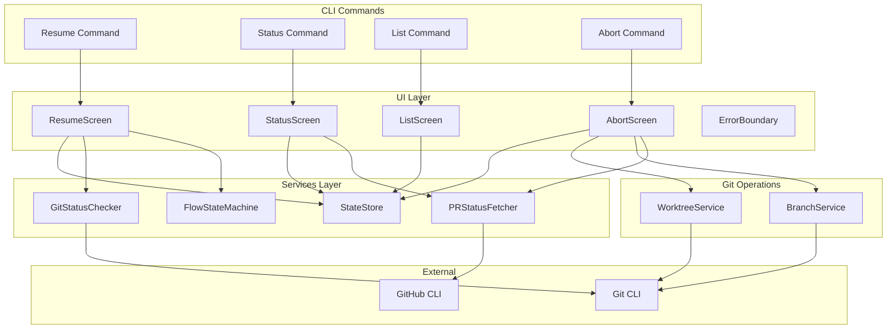
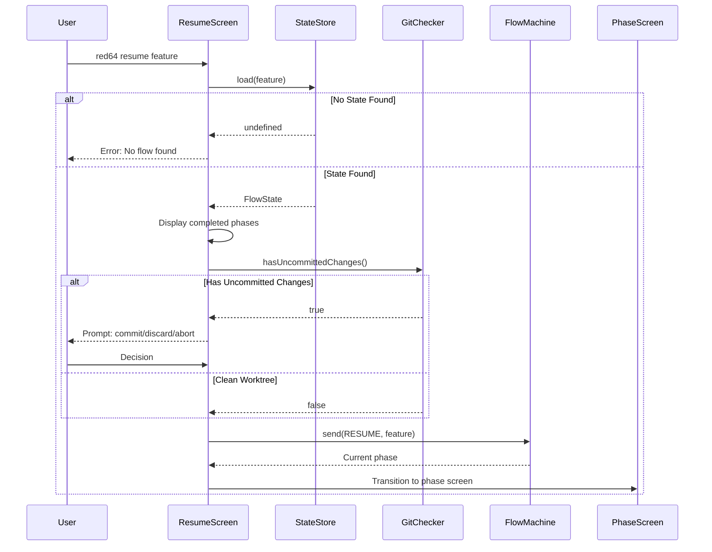
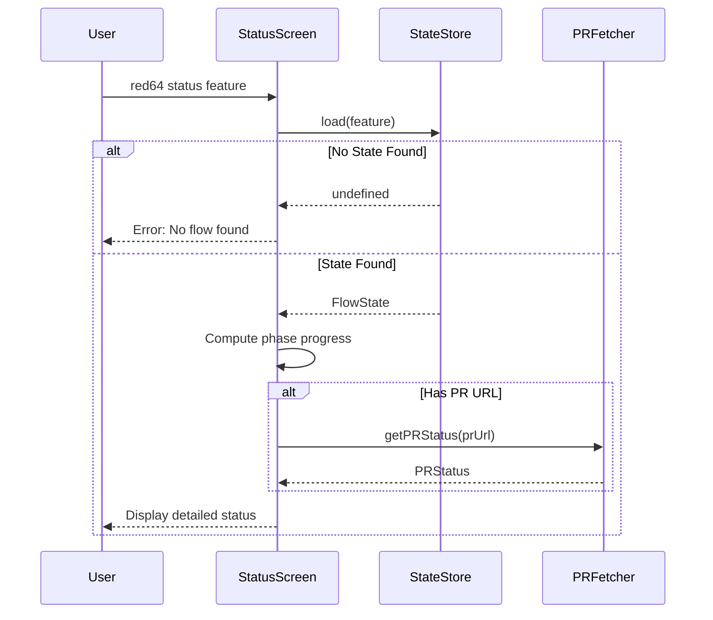
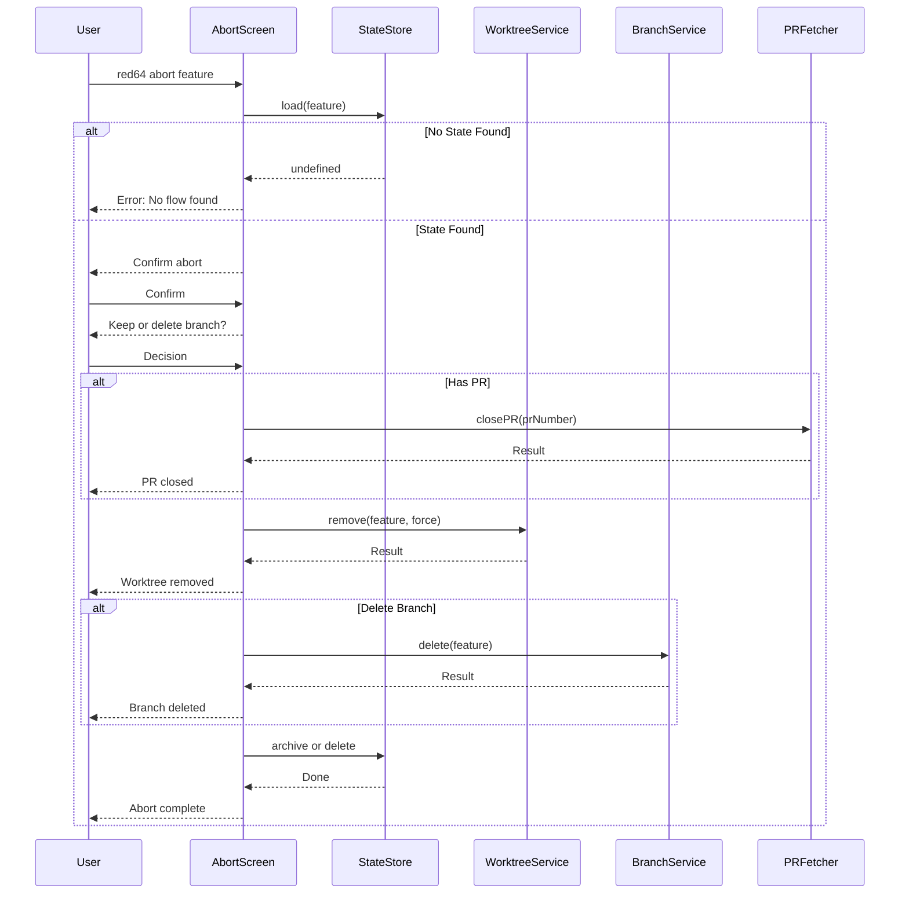
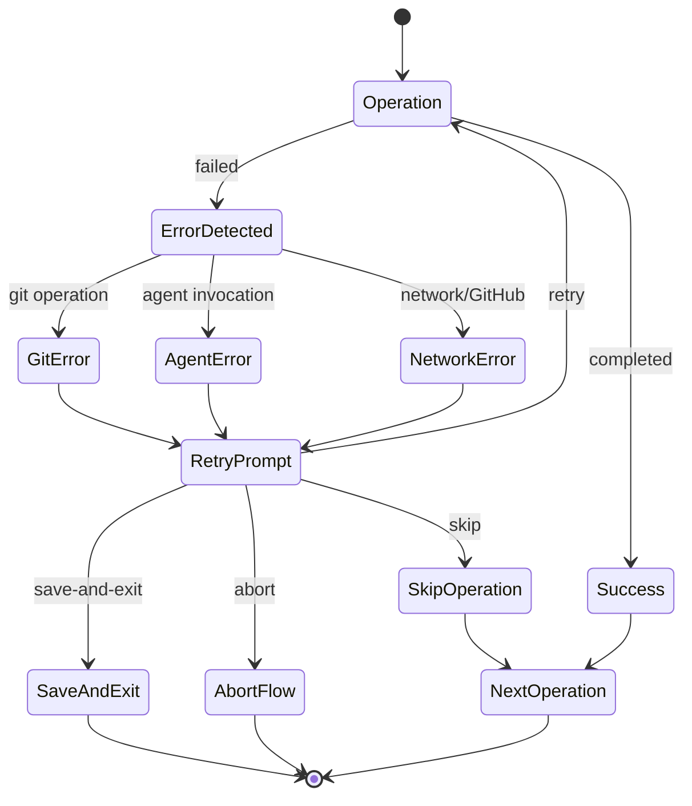

# Technical Design Document: red64-flow-management

## Overview

**Purpose**: This feature delivers workflow management commands for red64-cli, enabling developers to resume interrupted flows, view flow status and listings, abort unwanted flows, and handle errors gracefully across all workflow operations.

**Users**: Developers will utilize these commands to manage ongoing feature flows: `red64 resume` to continue interrupted work, `red64 status` to inspect flow details, `red64 list` to track all active flows, and `red64 abort` to cleanup unwanted flows.

**Impact**: Extends the scaffold shell implementations with full functionality, replacing placeholder screens with production-ready components that integrate with StateStore, WorktreeService, and error handling infrastructure.

### Goals
- Implement `resume` command with state restoration and uncommitted change detection
- Implement `status` command with detailed phase visualization and PR info
- Implement `list` command with multi-flow summary table
- Implement `abort` command with confirmation prompts and resource cleanup
- Establish error handling patterns with retry/skip/abort recovery options
- Integrate error boundaries in Ink components

### Non-Goals
- Flow creation (covered by red64-flow-core start command)
- Multi-repository workflow management
- Automatic conflict resolution
- Flow migration between different spec versions

## Architecture

### Existing Architecture Analysis

The scaffold and flow-core specs provide foundational components that this feature extends:
- **StateStore**: Atomic persistence with `load`, `list`, `delete`, `exists` methods
- **WorktreeService**: Git worktree operations with `check`, `remove`, `list` methods
- **ExtendedFlowStateMachine**: State machine with RESUME event support
- **Screen shells**: ResumeScreen, StatusScreen, ListScreen, AbortScreen placeholders
- **UI components**: Spinner, StatusLine, SelectMenu, Header, OutputRegion

Key patterns preserved:
- Service factory functions for dependency injection
- Discriminated unions for type-safe phase/event handling
- React component patterns per Ink steering
- ScreenProps interface for command routing

### Architecture Pattern & Boundary Map



**Architecture Integration**:
- Selected pattern: Extension of existing layered architecture
- Domain/feature boundaries: Git status checking isolated in service; abort cleanup orchestrated by screen
- Existing patterns preserved: Service factory functions, ScreenProps interface, StateStore persistence
- New components rationale: GitStatusChecker encapsulates uncommitted change detection; PRStatusFetcher wraps GitHub CLI PR queries
- Steering compliance: Follows Ink patterns from `.kiro/steering/ink.md`

### Technology Stack

| Layer | Choice / Version | Role in Feature | Notes |
|-------|------------------|-----------------|-------|
| CLI Framework | Ink 5.x | Terminal UI for all management screens | Existing |
| UI Components | @inkjs/ui 2.x | Spinner, Select, ConfirmInput | Existing |
| Git Operations | Git CLI (system) | Status check, worktree/branch cleanup | Via spawn() |
| PR Operations | GitHub CLI (gh) | Close PR on abort, fetch PR status | Via spawn() |
| Time Formatting | date-fns 3.x | Relative timestamp formatting | New dependency |

## System Flows

### Resume Command Flow



### Status Command Flow



### Abort Command Flow



### Error Handling Flow



## Requirements Traceability

| Requirement | Summary | Components | Interfaces | Flows |
|-------------|---------|------------|------------|-------|
| 1.1-1.2 | Read flow-state, compute resume point | ResumeScreen, StateStore | loadFlowState(), computeResumePhase() | Resume Flow |
| 1.3 | Uncommitted changes prompt | ResumeScreen, GitStatusChecker | hasUncommittedChanges() | Resume Flow |
| 1.4 | Display completed phases | ResumeScreen, PhaseProgressView | PhaseProgressProps | Resume Flow |
| 1.5-1.6 | Re-enter state machine, handle missing state | ResumeScreen, FlowMachine | send(RESUME), load() | Resume Flow |
| 2.1-2.2 | Detailed phase display | StatusScreen, PhaseProgressView | PhaseProgressProps | Status Flow |
| 2.3 | Relative timestamps | StatusScreen, formatRelativeTime | formatRelativeTime() | Status Flow |
| 2.4 | PR status display | StatusScreen, PRStatusFetcher | getPRStatus() | Status Flow |
| 2.5 | Task counts | StatusScreen | TaskCountProps | Status Flow |
| 2.6 | Missing flow error | StatusScreen | N/A | Status Flow |
| 3.1-3.2 | Scan worktrees, read states | ListScreen, StateStore | list() | List Flow |
| 3.3-3.4 | Table display with timestamps | ListScreen, FlowTable | FlowTableProps | List Flow |
| 3.5 | Empty state message | ListScreen | N/A | List Flow |
| 4.1-4.2 | Confirmation prompt, branch options | AbortScreen, ConfirmDialog | AbortOptionsProps | Abort Flow |
| 4.3 | Close PR | AbortScreen, PRStatusFetcher | closePR() | Abort Flow |
| 4.4 | Remove worktree | AbortScreen, WorktreeService | remove() | Abort Flow |
| 4.5 | Archive flow state | AbortScreen, StateStore | archive() | Abort Flow |
| 4.6 | Report cleanup results | AbortScreen, CleanupReport | CleanupReportProps | Abort Flow |
| 5.1 | Git error recovery | ErrorRecoveryPrompt | RecoveryOptions | Error Flow |
| 5.2 | Agent error recovery | ErrorRecoveryPrompt | RecoveryOptions | Error Flow |
| 5.3 | Network error recovery | ErrorRecoveryPrompt | RecoveryOptions | Error Flow |
| 5.4 | Pre-operation state save | All screens, StateStore | save() | All Flows |
| 5.5 | Error boundaries | ErrorBoundary | ErrorBoundaryProps | All Flows |
| 5.6 | Actionable error messages | ErrorDisplay | ErrorDisplayProps | All Flows |

## Components and Interfaces

| Component | Domain/Layer | Intent | Req Coverage | Key Dependencies (P0/P1) | Contracts |
|-----------|--------------|--------|--------------|--------------------------|-----------|
| ResumeScreen | UI | Resume interrupted flow with change detection | 1.1-1.6 | StateStore (P0), GitStatusChecker (P0), FlowMachine (P0) | State |
| StatusScreen | UI | Display detailed flow status | 2.1-2.6 | StateStore (P0), PRStatusFetcher (P1) | State |
| ListScreen | UI | Display all active flows | 3.1-3.5 | StateStore (P0) | State |
| AbortScreen | UI | Abort flow with cleanup | 4.1-4.6 | StateStore (P0), WorktreeService (P0), BranchService (P1), PRStatusFetcher (P1) | State |
| GitStatusChecker | Services | Check for uncommitted changes | 1.3, 5.1 | Git CLI (P0) | Service |
| PRStatusFetcher | Services | Fetch and close PRs | 2.4, 4.3 | GitHub CLI (P0) | Service |
| BranchService | Services | Delete feature branches | 4.2 | Git CLI (P0) | Service |
| ErrorBoundary | UI | Catch and display component errors | 5.5 | None | State |
| ErrorRecoveryPrompt | UI | Prompt for error recovery action | 5.1-5.3 | None | State |
| PhaseProgressView | UI | Visualize phase completion | 1.4, 2.1-2.2 | None | - |
| FlowTable | UI | Render flow listing table | 3.3 | None | - |
| ErrorDisplay | UI | Render actionable error messages | 5.6 | None | - |

### Services Layer

#### GitStatusChecker

| Field | Detail |
|-------|--------|
| Intent | Check git working directory for uncommitted changes |
| Requirements | 1.3, 5.1 |

**Responsibilities & Constraints**
- Execute `git status --porcelain` to detect changes
- Return boolean indicating presence of uncommitted changes
- Differentiate between staged, unstaged, and untracked changes
- Handle worktree context correctly

**Dependencies**
- External: Git CLI - status command (P0)

**Contracts**: Service [x] / API [ ] / Event [ ] / Batch [ ] / State [ ]

##### Service Interface
```typescript
interface GitStatus {
  readonly hasChanges: boolean;
  readonly staged: number;
  readonly unstaged: number;
  readonly untracked: number;
}

interface GitStatusCheckerService {
  check(workingDir: string): Promise<GitStatus>;
  hasUncommittedChanges(workingDir: string): Promise<boolean>;
}

function createGitStatusChecker(): GitStatusCheckerService;
```
- Preconditions: workingDir is a valid git repository or worktree
- Postconditions: GitStatus returned with accurate counts
- Invariants: Empty status output means no changes

**Implementation Notes**
- Command: `git status --porcelain`
- Parse output: Lines starting with `M`, `A`, `D`, `??`, etc.
- Risks: Git not installed; return error status

#### PRStatusFetcher

| Field | Detail |
|-------|--------|
| Intent | Fetch PR status and close PRs via GitHub CLI |
| Requirements | 2.4, 4.3 |

**Responsibilities & Constraints**
- Fetch PR status by number or URL
- Return merge state, review status, CI status
- Close PR on abort (without merge)
- Handle unauthenticated state

**Dependencies**
- External: GitHub CLI (gh) - pr view, pr close commands (P0)

**Contracts**: Service [x] / API [ ] / Event [ ] / Batch [ ] / State [ ]

##### Service Interface
```typescript
interface PRStatus {
  readonly number: number;
  readonly url: string;
  readonly state: 'open' | 'closed' | 'merged';
  readonly mergeable: boolean;
  readonly reviewDecision: 'approved' | 'changes_requested' | 'review_required' | 'unknown';
  readonly checksStatus: 'passing' | 'failing' | 'pending' | 'unknown';
}

interface PRCloseResult {
  readonly success: boolean;
  readonly error: string | undefined;
}

interface PRStatusFetcherService {
  getStatus(prNumberOrUrl: string | number): Promise<PRStatus | undefined>;
  close(prNumber: number): Promise<PRCloseResult>;
}

function createPRStatusFetcher(): PRStatusFetcherService;
```
- Preconditions: gh CLI installed and authenticated
- Postconditions: PRStatus or undefined if not found; PR closed on close()
- Invariants: Never merges PR on close

**Implementation Notes**
- View: `gh pr view <number> --json number,url,state,mergeable,reviewDecision,statusCheckRollup`
- Close: `gh pr close <number>`
- Risks: gh not authenticated; detect and return error

#### BranchService

| Field | Detail |
|-------|--------|
| Intent | Delete feature branches on abort |
| Requirements | 4.2 |

**Responsibilities & Constraints**
- Delete local branch by name
- Optionally delete remote branch
- Handle branch protection gracefully

**Dependencies**
- External: Git CLI - branch commands (P0)

**Contracts**: Service [x] / API [ ] / Event [ ] / Batch [ ] / State [ ]

##### Service Interface
```typescript
interface BranchDeleteResult {
  readonly success: boolean;
  readonly error: string | undefined;
}

interface BranchServiceInterface {
  deleteLocal(branchName: string, force?: boolean): Promise<BranchDeleteResult>;
  deleteRemote(branchName: string): Promise<BranchDeleteResult>;
  exists(branchName: string): Promise<boolean>;
}

function createBranchService(): BranchServiceInterface;
```
- Preconditions: Current working directory is in git repo
- Postconditions: Branch deleted or error returned
- Invariants: Never deletes main/master branches

**Implementation Notes**
- Delete local: `git branch -D <branch>` (force) or `git branch -d <branch>`
- Delete remote: `git push origin --delete <branch>`
- Protection: Check branch name against protected list before delete

### UI Layer

#### ResumeScreen (Implementation)

| Field | Detail |
|-------|--------|
| Intent | Full resume command implementation with state restoration and uncommitted change handling |
| Requirements | 1.1-1.6 |

**Responsibilities & Constraints**
- Load persisted flow state
- Display completed phases with checkmarks
- Check for uncommitted changes in worktree
- Prompt user for commit/discard/abort if changes exist
- Re-enter state machine at persisted phase
- Handle missing state gracefully

**Dependencies**
- Inbound: CommandRouter - renders on resume command (P0)
- Outbound: StateStore - load flow state (P0)
- Outbound: GitStatusChecker - check uncommitted changes (P0)
- Outbound: FlowMachine - RESUME event (P0)

**Contracts**: Service [ ] / API [ ] / Event [ ] / Batch [ ] / State [x]

##### State Management
```typescript
type ResumeScreenState =
  | { step: 'loading' }
  | { step: 'not-found'; feature: string }
  | { step: 'uncommitted-changes'; flowState: FlowState; gitStatus: GitStatus }
  | { step: 'resuming'; flowState: FlowState }
  | { step: 'resumed'; flowState: FlowState }
  | { step: 'error'; error: string };
```
- Persistence: Via FlowMachine -> StateStore
- Concurrency: Single screen instance

**Implementation Notes**
- Display: PhaseProgressView for completed phases
- Uncommitted prompt: SelectMenu with options: "Commit changes", "Discard changes", "Abort resume"
- Commit: Execute `git add -A && git commit -m "WIP: <feature>"` on user selection
- Discard: Execute `git checkout -- .` on user selection

#### StatusScreen (Implementation)

| Field | Detail |
|-------|--------|
| Intent | Display detailed flow status with phase progress, timestamps, PR info, and task counts |
| Requirements | 2.1-2.6 |

**Responsibilities & Constraints**
- Load flow state for specified feature
- Display phase progress with visual indicators
- Show relative timestamps for last updated
- Fetch and display PR status if applicable
- Show task completion counts in implementation phase
- Handle missing state gracefully

**Dependencies**
- Inbound: CommandRouter - renders on status command (P0)
- Outbound: StateStore - load flow state (P0)
- Outbound: PRStatusFetcher - get PR status (P1)

**Contracts**: Service [ ] / API [ ] / Event [ ] / Batch [ ] / State [x]

##### State Management
```typescript
type StatusScreenState =
  | { step: 'loading' }
  | { step: 'not-found'; feature: string }
  | { step: 'loaded'; flowState: FlowState; prStatus: PRStatus | undefined }
  | { step: 'error'; error: string };
```
- Persistence: Read-only
- Concurrency: Single screen instance

**Implementation Notes**
- Phase indicators: Checkmark for completed, filled circle for current, empty circle for pending
- Timestamps: Use date-fns `formatDistanceToNow` for "2 hours ago" style
- Task counts: Extract from implementing phase `currentTask` and `totalTasks`

#### ListScreen (Implementation)

| Field | Detail |
|-------|--------|
| Intent | Display all active flows in a table with summary information |
| Requirements | 3.1-3.5 |

**Responsibilities & Constraints**
- Load all flow states via StateStore.list()
- Display table with Feature, Phase, Branch, Last Updated columns
- Show relative timestamps
- Handle empty state with helpful message

**Dependencies**
- Inbound: CommandRouter - renders on list command (P0)
- Outbound: StateStore - list all flows (P0)

**Contracts**: Service [ ] / API [ ] / Event [ ] / Batch [ ] / State [x]

##### State Management
```typescript
type ListScreenState =
  | { step: 'loading' }
  | { step: 'loaded'; flows: readonly FlowState[] }
  | { step: 'error'; error: string };
```
- Persistence: Read-only
- Concurrency: Single screen instance

**Implementation Notes**
- Table: Use Box with fixed-width columns
- Empty state: "No active flows. Start one with: red64 start <feature> \"description\""
- Sort: By updatedAt descending (most recent first)

#### AbortScreen (Implementation)

| Field | Detail |
|-------|--------|
| Intent | Abort flow with confirmation, cleanup options, and result reporting |
| Requirements | 4.1-4.6 |

**Responsibilities & Constraints**
- Load flow state and confirm abort action
- Offer branch deletion options
- Close PR if exists
- Remove git worktree
- Archive or delete flow state
- Report success/failure for each cleanup action

**Dependencies**
- Inbound: CommandRouter - renders on abort command (P0)
- Outbound: StateStore - load, delete, archive (P0)
- Outbound: WorktreeService - remove worktree (P0)
- Outbound: BranchService - delete branch (P1)
- Outbound: PRStatusFetcher - close PR (P1)

**Contracts**: Service [ ] / API [ ] / Event [ ] / Batch [ ] / State [x]

##### State Management
```typescript
interface CleanupResult {
  readonly action: string;
  readonly success: boolean;
  readonly error: string | undefined;
}

type AbortScreenState =
  | { step: 'loading' }
  | { step: 'not-found'; feature: string }
  | { step: 'confirm'; flowState: FlowState }
  | { step: 'branch-options'; flowState: FlowState }
  | { step: 'cleaning'; flowState: FlowState; results: readonly CleanupResult[] }
  | { step: 'complete'; results: readonly CleanupResult[] }
  | { step: 'error'; error: string };

interface AbortOptions {
  readonly deleteBranch: boolean;
  readonly archiveState: boolean;
}
```
- Persistence: Delete or archive via StateStore
- Concurrency: Single screen instance

**Implementation Notes**
- Confirmation: "Are you sure you want to abort flow '<feature>'? This cannot be undone."
- Branch options: SelectMenu with "Delete branch", "Keep branch"
- Archive: Rename state.json to state.archived.json
- Results: Show checkmarks/X marks for each cleanup action

#### ErrorBoundary

| Field | Detail |
|-------|--------|
| Intent | Catch unhandled errors in Ink components and display gracefully |
| Requirements | 5.5 |

React class component following Ink steering patterns.

```typescript
interface ErrorBoundaryProps {
  readonly children: React.ReactNode;
  readonly onError?: (error: Error) => void;
}

interface ErrorBoundaryState {
  readonly error: Error | null;
}
```

**Implementation Notes**
- Use getDerivedStateFromError for error capture
- Display red error message with stack trace in debug mode
- Provide "Press any key to exit" prompt

#### ErrorRecoveryPrompt

| Field | Detail |
|-------|--------|
| Intent | Prompt user for error recovery action |
| Requirements | 5.1-5.3 |

```typescript
type RecoveryOption = 'retry' | 'skip' | 'save-and-exit' | 'abort';

interface ErrorRecoveryPromptProps {
  readonly error: Error;
  readonly errorType: 'git' | 'agent' | 'network';
  readonly onSelect: (option: RecoveryOption) => void;
}
```

**Implementation Notes**
- Git errors: Show retry/skip/abort
- Agent errors: Show retry/continue/abort
- Network errors: Show retry/save-and-exit/abort
- Use SelectMenu for option selection

#### PhaseProgressView

| Field | Detail |
|-------|--------|
| Intent | Visualize phase completion with checkmarks and status indicators |
| Requirements | 1.4, 2.1, 2.2 |

Summary-only component with no new boundaries.

```typescript
interface PhaseProgressViewProps {
  readonly phases: readonly ExtendedFlowPhase['type'][];
  readonly currentPhase: ExtendedFlowPhase['type'];
  readonly mode: WorkflowMode;
}
```

**Implementation Notes**
- Completed: Green checkmark
- Current: Yellow filled circle with spinner
- Pending: Dim empty circle
- Use GREENFIELD_PHASES or BROWNFIELD_PHASES based on mode

#### FlowTable

| Field | Detail |
|-------|--------|
| Intent | Render table of active flows |
| Requirements | 3.3, 3.4 |

Summary-only component with no new boundaries.

```typescript
interface FlowTableProps {
  readonly flows: readonly FlowState[];
}
```

**Implementation Notes**
- Columns: Feature (20 chars), Phase (25 chars), Branch (25 chars), Updated (15 chars)
- Use Box with borderStyle for table structure
- Truncate long values with ellipsis

#### ErrorDisplay

| Field | Detail |
|-------|--------|
| Intent | Display actionable error messages with suggested fixes |
| Requirements | 5.6 |

Summary-only component with no new boundaries.

```typescript
interface ErrorDisplayProps {
  readonly error: Error;
  readonly suggestion: string;
}
```

**Implementation Notes**
- Red color for error message
- Yellow for suggestion
- Include relevant file paths or commands

## Data Models

### Domain Model

**Aggregates**:
- Flow: Root aggregate accessed via StateStore

**Entities**:
- FlowState: Extended with metadata for PR info (already defined in extended-flow.ts)

**Value Objects**:
- GitStatus: Uncommitted change counts
- PRStatus: Pull request state
- CleanupResult: Abort cleanup action result
- RecoveryOption: Error recovery choice

**Domain Events**:
- FlowResumed: Flow continued from persisted state
- FlowAborted: Flow cleanup completed
- ErrorRecovered: User selected recovery option

**Invariants**:
- Resume requires existing flow state
- Abort requires user confirmation
- PR close only attempted if PR exists

### Logical Data Model

**GitStatus Structure**:
```typescript
interface GitStatus {
  readonly hasChanges: boolean;
  readonly staged: number;
  readonly unstaged: number;
  readonly untracked: number;
}
```

**PRStatus Structure**:
```typescript
interface PRStatus {
  readonly number: number;
  readonly url: string;
  readonly state: 'open' | 'closed' | 'merged';
  readonly mergeable: boolean;
  readonly reviewDecision: 'approved' | 'changes_requested' | 'review_required' | 'unknown';
  readonly checksStatus: 'passing' | 'failing' | 'pending' | 'unknown';
}
```

**CleanupResult Structure**:
```typescript
interface CleanupResult {
  readonly action: string;
  readonly success: boolean;
  readonly error: string | undefined;
}
```

### Data Contracts & Integration

**StateStore Extension**:
```typescript
// Add archive method to existing interface
interface StateStoreService {
  // ... existing methods
  archive(feature: string): Promise<void>;
}
```

Archive implementation: Rename `state.json` to `state.archived.json`.

## Error Handling

### Error Strategy

Errors are categorized by source with typed recovery options. All operations persist state before execution to enable resume.

### Error Categories and Responses

**Git Errors** (5.1):
- Uncommitted changes: Prompt commit/discard/abort
- Worktree remove failed: Show error, offer force or skip
- Branch delete failed: Show error, offer skip

**Agent Errors** (5.2):
- Agent timeout: Retry up to 3 times; then prompt
- Invalid output: Log output, retry once, then prompt
- Non-zero exit: Display stderr, offer retry/continue/abort

**Network Errors** (5.3):
- gh not authenticated: "Run 'gh auth login' first"
- PR fetch failed: Show error, continue without PR info
- PR close failed: Show error, offer retry or skip

**Error Recovery Options**:
| Error Type | Retry | Skip | Save-and-Exit | Abort |
|------------|-------|------|---------------|-------|
| Git | Yes | Yes | No | Yes |
| Agent | Yes | Yes (continue) | No | Yes |
| Network | Yes | No | Yes | Yes |

### Monitoring

- Log all errors with timestamps and context
- Persist error in flow state history
- Include error context in abort cleanup report

## Testing Strategy

### Unit Tests
- GitStatusChecker: Parse status output, detect changes, handle empty
- PRStatusFetcher: Parse PR JSON, handle missing fields, close PR
- BranchService: Delete local, delete remote, handle errors
- formatRelativeTime: Various timestamps, edge cases

### Integration Tests
- ResumeScreen: Load state -> check changes -> prompt -> resume
- StatusScreen: Load state -> fetch PR -> display
- ListScreen: Load all -> sort -> display table
- AbortScreen: Confirm -> cleanup sequence -> report

### E2E/UI Tests
- ResumeScreen: Uncommitted changes prompt, phase display
- StatusScreen: Phase progress view, PR status display
- ListScreen: Table rendering, empty state
- AbortScreen: Confirmation flow, cleanup results

### Component Tests (Ink)
- PhaseProgressView: Checkmarks, current indicator, pending phases
- FlowTable: Column alignment, truncation
- ErrorRecoveryPrompt: Option selection
- ErrorBoundary: Error capture and display

## Security Considerations

- **Branch Protection**: Never delete main/master/develop branches
- **Confirmation**: Destructive abort action requires explicit confirmation
- **PR Handling**: Close only, never merge without explicit user approval
- **Error Messages**: Do not leak sensitive paths or credentials in error output
