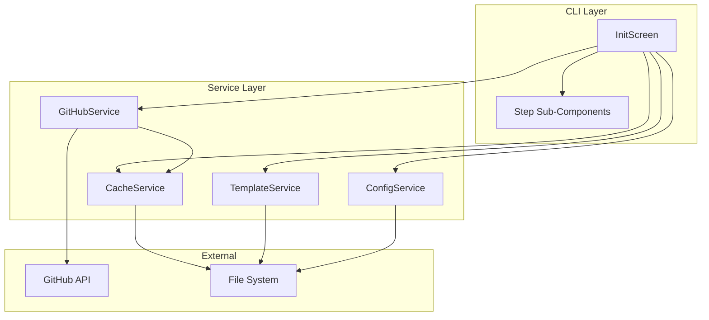
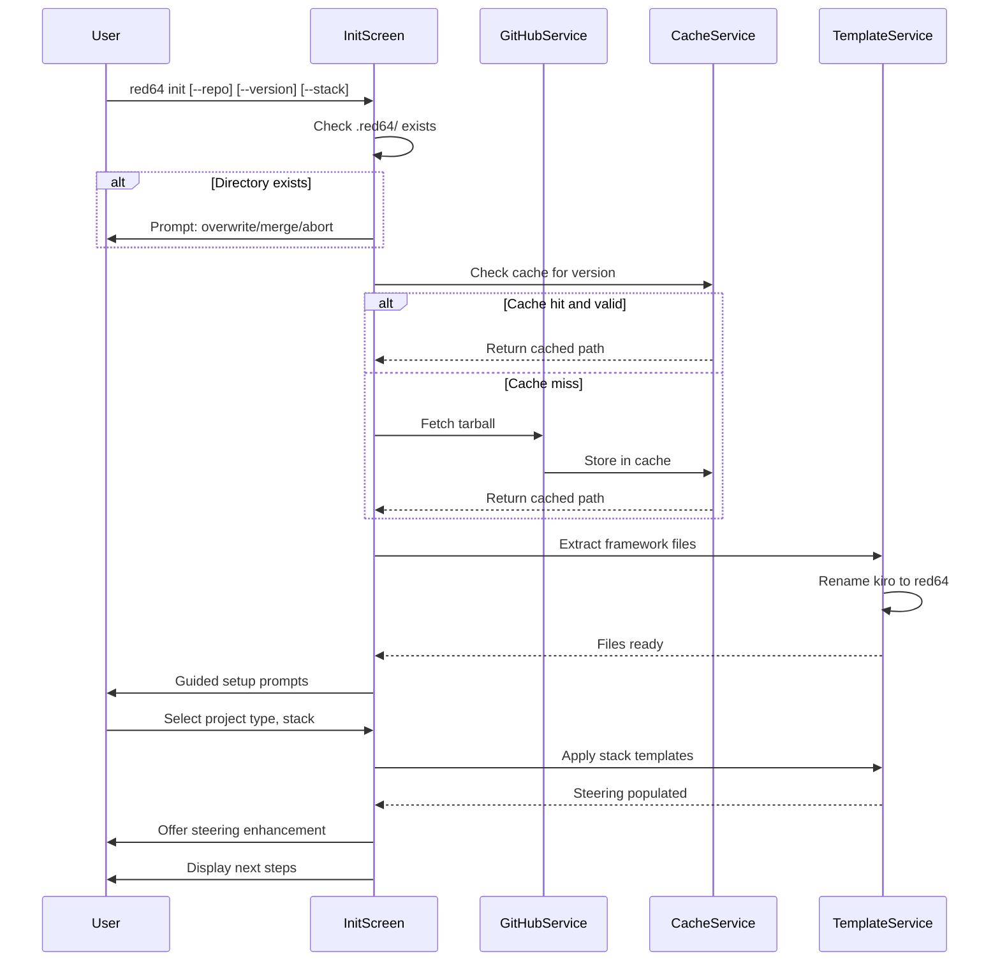
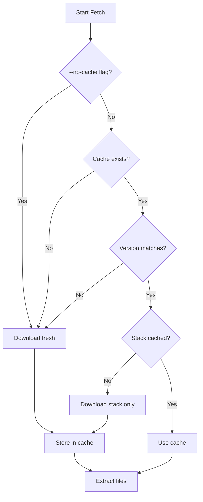

# Design Document: red64-init

## Overview

**Purpose**: This feature delivers the `red64 init` command that bootstraps projects for red64 spec-driven development flows. Users run a single command to create the `.red64/` directory structure, fetch framework files from GitHub, apply stack-specific steering templates, and optionally enhance them with AI assistance.

**Users**: Developers starting new projects or adding red64 to existing codebases will use this command to initialize their development environment with the complete red64 framework including commands, agents, templates, and steering documents.

**Impact**: Transforms a bare project into a fully configured red64 workspace with stack-appropriate conventions, patterns, and best practices pre-configured in steering documents.

### Goals

- Enable single-command project bootstrap with `red64 init`
- Fetch and install framework files from GitHub without requiring git
- Provide stack-specific steering templates for common technology stacks
- Guide users through interactive setup with clear prompts
- Support offline re-initialization via intelligent caching

### Non-Goals

- Implementing the steering enhancement commands (`/red64:steering`, `/red64:steering-custom`)
- Supporting private GitHub repositories in initial release
- Automatic stack detection from existing project files
- Git repository initialization or modification

## Architecture

### Architecture Pattern & Boundary Map



**Architecture Integration**:
- Selected pattern: Service-oriented with React component layer following existing codebase patterns
- Domain boundaries: CLI presentation (InitScreen), Infrastructure (GitHub/Cache services), Domain logic (Template processing)
- Existing patterns preserved: ScreenProps interface, service modules, path utilities
- New components rationale: Each service encapsulates a distinct concern (network, caching, file transformation)
- Steering compliance: Follows Ink framework patterns from `.kiro/steering/ink.md`

### Technology Stack

| Layer | Choice / Version | Role in Feature | Notes |
|-------|------------------|-----------------|-------|
| Frontend / CLI | Ink 5.x, @inkjs/ui 2.x, React 18.x | Interactive wizard UI, prompts, progress | Already installed |
| Backend / Services | Node.js 20+, native fetch | GitHub API requests, tarball download | Built-in fetch API |
| Data / Storage | fs/promises, tar | File system operations, archive extraction | Native + 1 dependency |
| Infrastructure / Runtime | Node.js 20+ | Runtime environment | Per package.json engines |

**New Dependencies**:
- `tar`: Tarball extraction (maintained by npm/node-tar team)

### Technology Alignment Note

See `research.md` for detailed investigation of GitHub API options, cache directory conventions, and Ink component patterns. Key decisions:
- Tarball download over Contents API for efficiency
- Platform-specific cache paths without additional dependencies
- Existing @inkjs/ui components for interactive prompts

## System Flows

### Init Command Flow



### Cache Decision Flow



## Requirements Traceability

| Requirement | Summary | Components | Interfaces | Flows |
|-------------|---------|------------|------------|-------|
| 1.1-1.7 | Project bootstrap and directory creation | InitScreen, TemplateService, ConfigService | TemplateService.extract(), ConfigService.save() | Init Command Flow |
| 2.1-2.7 | Unified directory structure | TemplateService, paths utility | TemplateService.createStructure() | Init Command Flow |
| 3.1-3.6 | Stack-specific templates | InitScreen, TemplateService | TemplateService.applyStackTemplates() | Init Command Flow |
| 4.1-4.9 | Interactive guided setup | InitScreen, step components | Step props, callbacks | Init Command Flow |
| 5.1-5.7 | Steering command integration | InitScreen | onSteeringRequest callback | Init Command Flow |
| 6.1-6.8 | GitHub framework fetch | GitHubService, CacheService | GitHubService.fetchTarball(), CacheService.get/set() | Init Command Flow, Cache Decision Flow |

## Components and Interfaces

| Component | Domain/Layer | Intent | Req Coverage | Key Dependencies (P0/P1) | Contracts |
|-----------|--------------|--------|--------------|--------------------------|-----------|
| InitScreen | UI/Screen | Orchestrate init wizard flow | 1.1-1.7, 4.1-4.9, 5.1-5.7 | GitHubService (P0), CacheService (P0), TemplateService (P0) | State |
| WelcomeStep | UI/Step | Display welcome, check existing | 1.6 | None | State |
| FetchStep | UI/Step | Show download progress | 1.7, 6.1-6.8 | GitHubService (P0) | State |
| SetupStep | UI/Step | Gather project info, stack selection | 4.2-4.8 | None | State |
| SteeringStep | UI/Step | Offer steering enhancement | 5.1-5.7 | None | State |
| CompleteStep | UI/Step | Show summary and next steps | 5.6 | None | State |
| GitHubService | Service | Fetch tarball from GitHub | 6.1-6.4 | CacheService (P1) | Service |
| CacheService | Service | Manage cached downloads | 6.5-6.8 | None | Service |
| TemplateService | Service | Extract, rename, apply templates | 1.3, 2.1-2.7, 3.1-3.6 | None | Service |
| ConfigService | Service | Read/write .red64/config.json | 2.7 | None | Service |

### UI Layer

#### InitScreen

| Field | Detail |
|-------|--------|
| Intent | Orchestrate the init command multi-step wizard flow |
| Requirements | 1.1-1.7, 4.1-4.9, 5.1-5.7 |

**Responsibilities & Constraints**
- Manage wizard step state and transitions
- Coordinate service calls based on user input
- Handle flags (--repo, --version, --stack, --skip-guided, --no-steering, --no-cache)
- Display appropriate step component based on current state

**Dependencies**
- Outbound: GitHubService - fetch framework files (P0)
- Outbound: CacheService - check/store cached files (P0)
- Outbound: TemplateService - extract and process files (P0)
- Outbound: ConfigService - persist init configuration (P1)

**Contracts**: State [x]

##### State Management

```typescript
type InitStep =
  | { type: 'welcome' }
  | { type: 'checking-existing'; path: string }
  | { type: 'conflict-prompt'; existingPath: string }
  | { type: 'fetching'; progress: FetchProgress }
  | { type: 'extracting' }
  | { type: 'guided-setup'; data: Partial<SetupData> }
  | { type: 'applying-templates' }
  | { type: 'steering-prompt' }
  | { type: 'complete'; summary: InitSummary }
  | { type: 'error'; error: InitError };

interface FetchProgress {
  readonly phase: 'connecting' | 'downloading' | 'caching';
  readonly bytesReceived?: number;
  readonly totalBytes?: number;
}

interface SetupData {
  readonly projectType: ProjectType;
  readonly stack: string;
  readonly projectName: string;
  readonly description: string;
  readonly customValues: Record<string, string>;
}

type ProjectType = 'web-app' | 'cli-tool' | 'library' | 'api' | 'other';

interface InitSummary {
  readonly createdDirs: readonly string[];
  readonly appliedStack: string;
  readonly configPath: string;
  readonly steeringFiles: readonly string[];
}

interface InitError {
  readonly code: 'NETWORK_ERROR' | 'PERMISSION_ERROR' | 'EXTRACTION_ERROR' | 'INVALID_REPO';
  readonly message: string;
  readonly recoverable: boolean;
  readonly suggestion?: string;
}
```

**Implementation Notes**
- Integration: Replaces existing placeholder InitScreen; receives ScreenProps from CommandRouter
- Validation: Validate repo URL format before fetch; check write permissions before extraction
- Risks: Long-running operations may timeout; handle gracefully with progress indication

#### Step Sub-Components

| Field | Detail |
|-------|--------|
| Intent | Render individual wizard steps with isolated concerns |
| Requirements | 1.6, 1.7, 4.2-4.8, 5.1-5.7, 6.1-6.8 |

**Base Step Props**

```typescript
interface BaseStepProps {
  readonly onNext: () => void;
  readonly onError: (error: InitError) => void;
}
```

Each step component extends BaseStepProps with step-specific props. Steps are presentational, delegating business logic to parent InitScreen or services.

**WelcomeStep**: Displays welcome message, checks for existing .red64/ directory
**FetchStep**: Shows spinner/progress during download, reports completion or error
**SetupStep**: Renders project type selection, stack selection, name/description inputs
**SteeringStep**: Offers to run steering commands, handles user response
**CompleteStep**: Displays summary of created files and next steps

### Service Layer

#### GitHubService

| Field | Detail |
|-------|--------|
| Intent | Fetch framework tarball from GitHub API |
| Requirements | 6.1-6.4 |

**Responsibilities & Constraints**
- Construct GitHub API URLs for tarball download
- Follow redirects to actual tarball location
- Stream download with progress reporting
- Support custom repository and version/tag

**Dependencies**
- External: GitHub API - tarball endpoint (P0)
- Outbound: CacheService - store downloaded tarball (P1)

**Contracts**: Service [x]

##### Service Interface

```typescript
interface GitHubServiceConfig {
  readonly defaultRepo: string;
  readonly defaultVersion: string;
}

interface FetchOptions {
  readonly repo?: string;
  readonly version?: string;
  readonly onProgress?: (progress: FetchProgress) => void;
}

interface FetchResult {
  readonly tarballPath: string;
  readonly version: string;
  readonly repo: string;
  readonly fromCache: boolean;
}

interface GitHubService {
  /**
   * Fetch framework tarball from GitHub
   * @throws GitHubFetchError on network failure, invalid repo, or rate limiting
   */
  fetchTarball(options: FetchOptions): Promise<FetchResult>;

  /**
   * List available stacks from repository
   * @throws GitHubFetchError on network failure
   */
  listAvailableStacks(options: Pick<FetchOptions, 'repo' | 'version'>): Promise<readonly string[]>;
}
```

- Preconditions: Network available, valid repo format (owner/repo)
- Postconditions: Tarball file exists at returned path, version resolved to actual tag/commit
- Invariants: Never modifies remote repository

**Implementation Notes**
- Integration: Use native `fetch()` with redirect following; pass progress via onProgress callback
- Validation: Validate repo format before request; check HTTP status codes
- Risks: Rate limiting (mitigated by tarball approach), network timeouts (implement retry)

#### CacheService

| Field | Detail |
|-------|--------|
| Intent | Manage cached framework downloads for offline support |
| Requirements | 6.5-6.8 |

**Responsibilities & Constraints**
- Determine platform-appropriate cache directory
- Store tarballs organized by version
- Validate cache entries against requested version
- Support cache bypass via flag

**Dependencies**
- External: File system - cache directory (P0)

**Contracts**: Service [x]

##### Service Interface

```typescript
interface CacheEntry {
  readonly path: string;
  readonly version: string;
  readonly repo: string;
  readonly cachedAt: string;
  readonly size: number;
}

interface CacheService {
  /**
   * Get cache directory path (platform-specific)
   */
  getCacheDir(): string;

  /**
   * Check if valid cache entry exists for version
   */
  has(repo: string, version: string): Promise<boolean>;

  /**
   * Get cached tarball path
   * @throws CacheError if entry does not exist
   */
  get(repo: string, version: string): Promise<CacheEntry>;

  /**
   * Store tarball in cache
   */
  set(repo: string, version: string, tarballPath: string): Promise<CacheEntry>;

  /**
   * Clear cache entries older than maxAge
   */
  prune(maxAgeMs: number): Promise<number>;

  /**
   * Clear all cache entries
   */
  clear(): Promise<void>;
}
```

- Preconditions: Cache directory writable
- Postconditions: Cache entries stored with metadata, retrievable by repo+version
- Invariants: Cache operations do not modify source files

**Implementation Notes**
- Integration: Cache root at `<platform_cache>/red64/`; store metadata in `cache.json`
- Validation: Verify file exists and size matches before returning cached entry
- Risks: Disk space exhaustion (implement prune); corrupted files (validate on read)

#### TemplateService

| Field | Detail |
|-------|--------|
| Intent | Extract tarball, rename references, apply stack templates |
| Requirements | 1.3, 2.1-2.7, 3.1-3.6 |

**Responsibilities & Constraints**
- Extract tarball to target directory
- Perform kiro-to-red64 renaming in file contents and paths
- Create unified .red64/ directory structure
- Copy stack-specific steering templates

**Dependencies**
- External: File system - target directory (P0)
- External: tar npm package - extraction (P0)

**Contracts**: Service [x]

##### Service Interface

```typescript
interface ExtractOptions {
  readonly tarballPath: string;
  readonly targetDir: string;
  readonly onProgress?: (file: string) => void;
}

interface StructureResult {
  readonly createdDirs: readonly string[];
  readonly createdFiles: readonly string[];
}

interface StackTemplateOptions {
  readonly sourceDir: string;
  readonly targetDir: string;
  readonly stack: string;
  readonly variables: Record<string, string>;
}

interface TemplateService {
  /**
   * Extract tarball and transform contents
   * - Extracts to targetDir/.red64/
   * - Renames kiro references to red64
   */
  extract(options: ExtractOptions): Promise<StructureResult>;

  /**
   * Create unified directory structure
   */
  createStructure(targetDir: string): Promise<StructureResult>;

  /**
   * Apply stack-specific steering templates
   */
  applyStackTemplates(options: StackTemplateOptions): Promise<readonly string[]>;

  /**
   * List available stacks in extracted source
   */
  listStacks(sourceDir: string): Promise<readonly string[]>;
}
```

- Preconditions: Tarball exists and is valid; target directory writable
- Postconditions: .red64/ structure created with all framework files; steering populated with stack templates
- Invariants: Never modifies files outside target directory

**Implementation Notes**
- Integration: Use `tar` package for extraction; stream-based for memory efficiency
- Validation: Verify extracted structure matches expected layout
- Risks: Incomplete extraction (verify file counts); permission errors (check upfront)

#### ConfigService

| Field | Detail |
|-------|--------|
| Intent | Manage .red64/config.json init configuration |
| Requirements | 2.7 |

**Responsibilities & Constraints**
- Read and write init configuration file
- Store repo source, version, stack, and custom values
- Provide defaults for missing configuration

**Dependencies**
- External: File system - config file (P0)

**Contracts**: Service [x]

##### Service Interface

```typescript
interface InitConfig {
  readonly version: string;
  readonly repo: string;
  readonly stack: string;
  readonly projectType: ProjectType;
  readonly projectName: string;
  readonly description: string;
  readonly initializedAt: string;
  readonly customValues: Record<string, string>;
}

interface ConfigService {
  /**
   * Load config from .red64/config.json
   * @returns null if file does not exist
   */
  load(baseDir: string): Promise<InitConfig | null>;

  /**
   * Save config to .red64/config.json
   */
  save(baseDir: string, config: InitConfig): Promise<void>;

  /**
   * Check if project is initialized
   */
  isInitialized(baseDir: string): Promise<boolean>;
}
```

- Preconditions: baseDir exists
- Postconditions: Config file created/updated atomically
- Invariants: Config file always valid JSON

## Data Models

### Domain Model

**Aggregates**:
- InitSession: Represents an active init operation with step state, user selections, and progress
- CacheRegistry: Tracks cached tarballs with version metadata

**Entities**:
- StackTemplate: A collection of steering files for a specific technology stack
- FrameworkRelease: A versioned snapshot of the red64 framework from GitHub

**Value Objects**:
- RepoIdentifier: owner/repo string with validation
- SemanticVersion: Parsed version tag with comparison
- FilePath: Validated file system path

**Business Rules**:
- Only one init operation per project directory at a time
- Cache entries expire after 30 days by default
- Stack selection must match available stacks in release

### Logical Data Model

**config.json Schema**:

```typescript
{
  "$schema": "http://json-schema.org/draft-07/schema#",
  "type": "object",
  "required": ["version", "repo", "stack", "initializedAt"],
  "properties": {
    "version": { "type": "string" },
    "repo": { "type": "string", "pattern": "^[\\w-]+/[\\w-]+$" },
    "stack": { "type": "string" },
    "projectType": {
      "type": "string",
      "enum": ["web-app", "cli-tool", "library", "api", "other"]
    },
    "projectName": { "type": "string" },
    "description": { "type": "string" },
    "initializedAt": { "type": "string", "format": "date-time" },
    "customValues": {
      "type": "object",
      "additionalProperties": { "type": "string" }
    }
  }
}
```

**cache.json Schema** (in cache directory):

```typescript
{
  "$schema": "http://json-schema.org/draft-07/schema#",
  "type": "object",
  "properties": {
    "entries": {
      "type": "array",
      "items": {
        "type": "object",
        "required": ["repo", "version", "path", "cachedAt", "size"],
        "properties": {
          "repo": { "type": "string" },
          "version": { "type": "string" },
          "path": { "type": "string" },
          "cachedAt": { "type": "string", "format": "date-time" },
          "size": { "type": "number" }
        }
      }
    }
  }
}
```

### Directory Structure

```
.red64/
  config.json           # Init configuration
  steering/             # Project steering documents
    product.md
    tech.md
    structure.md
    [custom].md
  specs/                # Feature specifications
  commands/             # Claude slash commands
  agents/               # Agent definitions
  templates/            # Spec and steering templates
  settings/             # Framework configuration and rules
    rules/
    templates/
```

## Error Handling

### Error Strategy

All services return typed errors via discriminated unions or throw typed exceptions. UI layer catches errors and transitions to error step with actionable guidance.

### Error Categories and Responses

**Network Errors** (NETWORK_ERROR):
- GitHub unreachable: Display retry option, suggest checking connection, offer cached version if available
- Rate limited: Explain rate limiting, suggest using cached version
- Timeout: Offer retry with longer timeout, suggest --no-cache if cache is suspect

**Permission Errors** (PERMISSION_ERROR):
- Cannot write to target: Display required permissions, suggest running from project root
- Cannot access cache: Warn and proceed without caching

**Extraction Errors** (EXTRACTION_ERROR):
- Corrupted tarball: Clear cache entry, offer re-download
- Incomplete extraction: Clean up partial files, retry extraction

**Validation Errors** (INVALID_REPO):
- Invalid repo format: Display expected format (owner/repo)
- Repo not found: Verify spelling, check public access

### Monitoring

- Log all GitHub API requests with timing for debugging
- Track cache hit/miss ratio for efficiency monitoring
- Record init completion vs abandonment for UX improvement

## Testing Strategy

### Unit Tests
- GitHubService: URL construction, redirect handling, progress calculation
- CacheService: Platform detection, path generation, entry validation
- TemplateService: Kiro-to-red64 replacement patterns, structure creation
- ConfigService: JSON serialization, schema validation

### Integration Tests
- Full init flow: From command to complete .red64/ structure
- Cache round-trip: Store tarball, retrieve on subsequent init
- Stack application: Verify correct templates copied for each stack
- Error recovery: Network failure during download, resume from cache

### E2E/CLI Tests
- `red64 init` with no flags: Interactive flow completion
- `red64 init --stack react --skip-guided`: Non-interactive mode
- `red64 init` with existing .red64/: Conflict handling (overwrite/merge/abort)
- `red64 init --no-cache`: Fresh download behavior

### Component Tests
- InitScreen step transitions: Each step renders correctly, navigation works
- SetupStep: Selection captures correct values
- FetchStep: Progress displays accurately, error state handles correctly

## Security Considerations

- **Input Validation**: Validate --repo flag format before any network request to prevent injection
- **Path Traversal**: Sanitize extracted file paths to prevent writing outside target directory
- **HTTPS Only**: All GitHub API requests use HTTPS; reject HTTP URLs
- **No Credentials Storage**: Do not store GitHub tokens; rely on public repos initially
- **File Permissions**: Create directories with 0o755, files with 0o644 (standard permissions)

## Performance & Scalability

- **Tarball Efficiency**: Single HTTP request for entire framework vs. hundreds for file-by-file
- **Streaming Extraction**: Use stream-based tar extraction to minimize memory usage
- **Progress Feedback**: Report download/extraction progress to maintain responsive UX
- **Cache Optimization**: Version-based cache keys enable offline re-init without re-download
- **Lazy Loading**: Only fetch stack templates when selected, not entire template library
