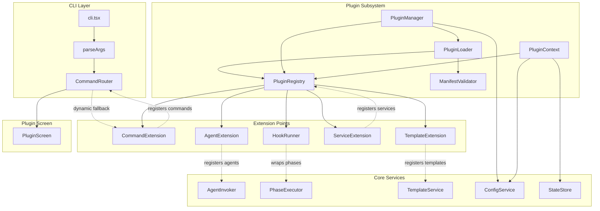
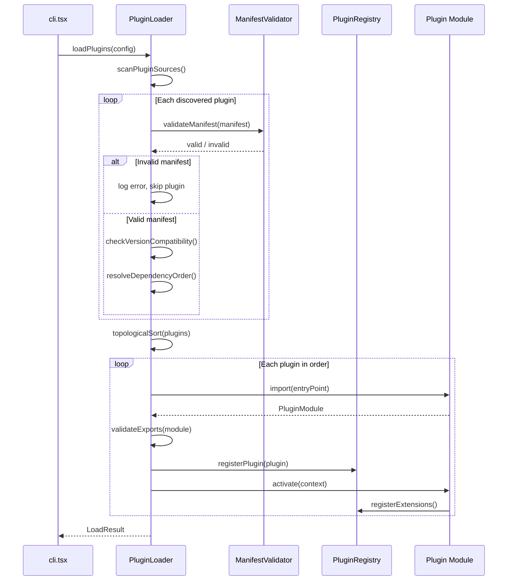
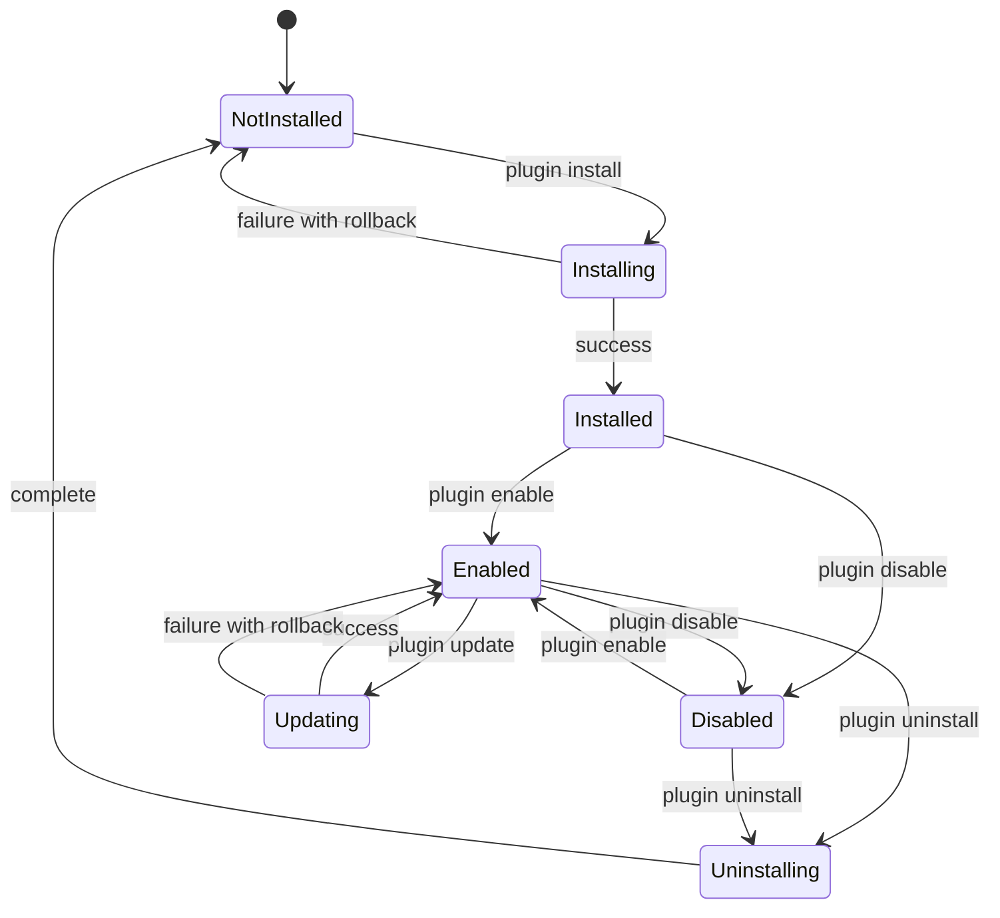
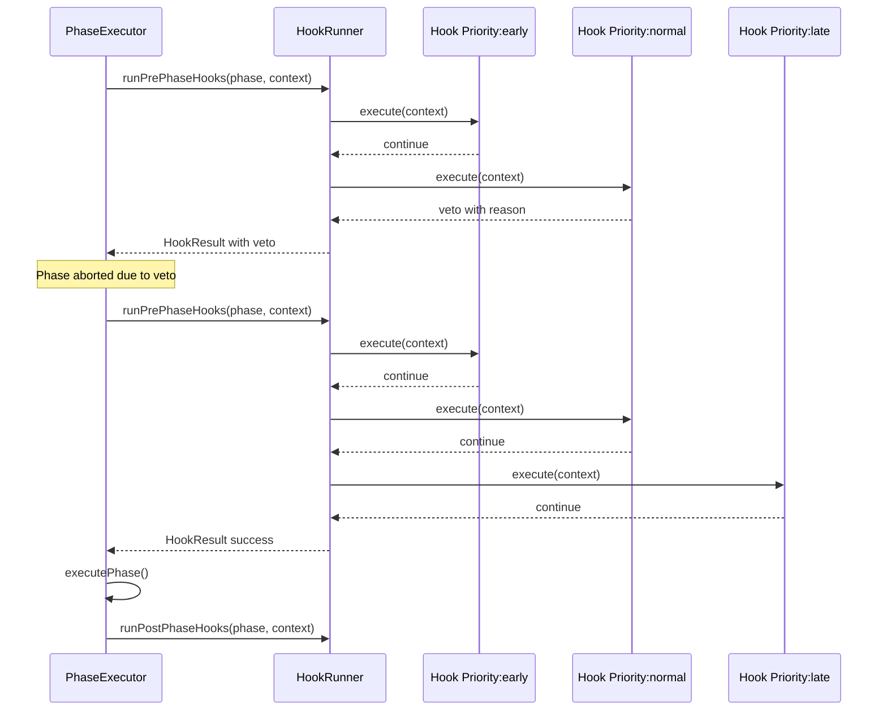
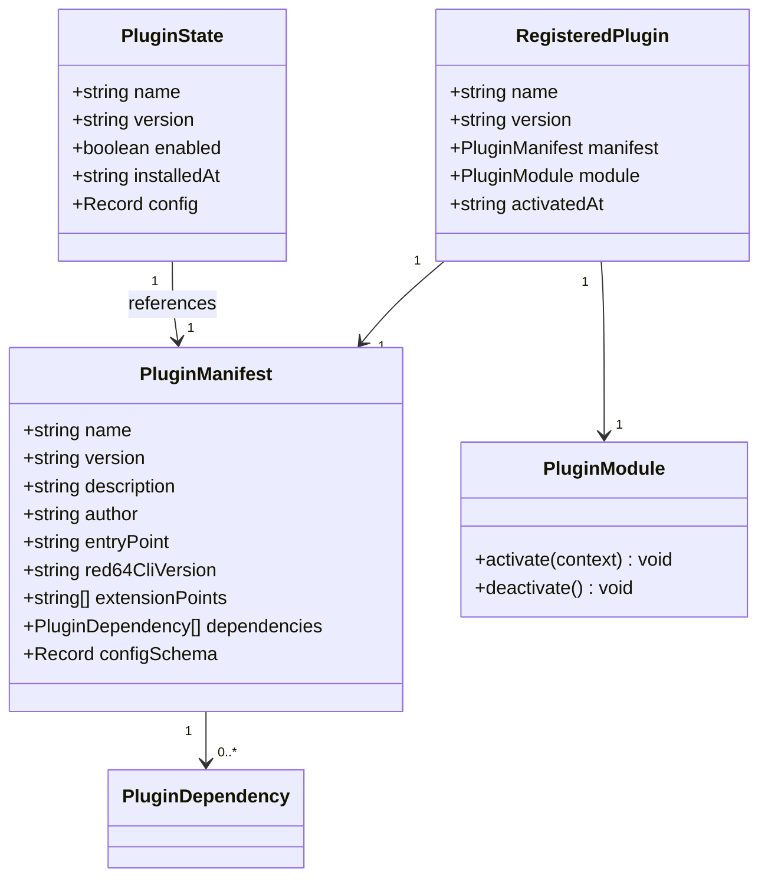

# Design Document

## Overview

**Purpose**: This feature delivers a comprehensive plugin system for red64-cli, enabling third-party developers to extend the spec-driven development orchestrator with custom commands, agent adapters, workflow hooks, services, and templates.

**Users**: Plugin developers will create extensions that augment red64-cli workflows. End users will discover, install, configure, and manage plugins through a dedicated CLI command group. Organizations will maintain private plugin registries for internal tooling.

**Impact**: Introduces a new `src/plugins/` subsystem and extends existing core services (CommandRouter, AgentInvoker, PhaseExecutor, TemplateService, ConfigService) with registration and extension points. The `Command` type union gains a `'plugin'` entry. No breaking changes to existing CLI behavior; plugins are opt-in.

### Goals

- Provide a stable, type-safe plugin API that enables third-party extensions without modifying core source code
- Support six extension points: commands, agents, hooks, services, templates, and configuration
- Deliver full lifecycle management (install, uninstall, enable, disable, update) via the `red64 plugin` command group
- Maintain security through controlled API surfaces, error isolation, and module validation
- Enable plugin discovery through the npm registry with keyword-based search

### Non-Goals

- GUI or web-based plugin marketplace (CLI-only in this iteration)
- Process-level sandboxing or vm.Module isolation (in-process with error boundaries)
- Automatic plugin dependency version resolution (plugins declare ranges, system validates)
- Plugin monetization, licensing enforcement, or digital signatures
- Multi-language plugin support (TypeScript/JavaScript ESM only)

## Architecture

### Existing Architecture Analysis

The current red64-cli follows a layered architecture: CLI entry (`cli.tsx`) parses arguments via `parseArgs.ts` and routes commands through `CommandRouter.tsx` to screen components that invoke services. Key constraints that affect plugin integration:

- **Static command routing**: `Command` is a TypeScript union type (`'init' | 'start' | 'status' | ...`). CommandRouter uses a switch statement. Dynamic commands require a fallback path.
- **Hardcoded agent configuration**: `CodingAgent` is `'claude' | 'gemini' | 'codex'` with static `AGENT_CLI_CONFIGS`. Custom agents require a registry lookup.
- **No hook system**: `PhaseExecutor` executes phases directly with hardcoded prompt templates. No pre/post-phase interception points exist.
- **Factory-based services**: Services use `create*` factory functions exported from a barrel index. No service locator or container.
- **ESM module system**: `"type": "module"` in package.json, `module: "ESNext"` in tsconfig. Dynamic `import()` is fully compatible.

### Architecture Pattern & Boundary Map



**Architecture Integration**:

- **Selected pattern**: Microkernel with service locator. The plugin subsystem acts as a microkernel providing a controlled API surface (PluginContext). Extension points mediate between plugins and core services. See `research.md` for pattern evaluation details.
- **Domain/feature boundaries**: The `src/plugins/` directory owns all plugin-specific logic. Core services receive thin extension interfaces (e.g., AgentInvoker gains a `resolveCustomAgent()` fallback). Extension point modules bridge the gap.
- **Existing patterns preserved**: Factory functions (`create*`), discriminated unions for state, React (Ink) for UI, `child_process.spawn()` for external processes, Vitest for testing.
- **New components rationale**: Each component in `src/plugins/` addresses a capability gap identified in the gap analysis. No existing service handles plugin discovery, manifest validation, lifecycle management, or extension point registration.
- **Steering compliance**: TypeScript strict mode, no `any` types, ESM modules, Vitest for tests, factory function pattern for service creation.

### Technology Stack

| Layer | Choice / Version | Role in Feature | Notes |
|-------|------------------|-----------------|-------|
| CLI | meow (existing), Ink (existing) | Plugin command parsing, PluginScreen UI | Add `'plugin'` to Command union |
| Services | Custom TypeScript | PluginLoader, PluginManager, PluginRegistry | New `src/plugins/` module |
| Data / Storage | JSON files in `.red64/` | Plugin config, enabled/disabled state | Extends existing `.red64/config.json` pattern |
| Validation | Zod (new dependency) | Manifest schema validation, config schema validation | Lightweight, TypeScript-native, tree-shakeable |
| Version Checking | semver (new dependency) | Plugin compatibility range validation | npm core team maintained, zero-dependency |
| File Watching | chokidar v5 (new dev dependency) | Dev mode hot reload of local plugins | ESM-only, Node.js 20+, production-proven |
| Registry | npm registry + native fetch | Plugin search, manifest resolution | No additional dependency; uses Node.js 20 built-in fetch |

## System Flows

### Plugin Discovery and Loading Flow



### Plugin Lifecycle Management Flow



### Workflow Hook Execution Flow



## Requirements Traceability

| Requirement | Summary | Components | Interfaces | Flows |
|-------------|---------|------------|------------|-------|
| 1.1 | Scan configured dirs and npm packages at startup | PluginLoader | PluginLoaderService | Discovery and Loading |
| 1.2 | Load plugins from local directory paths | PluginLoader | PluginLoaderService | Discovery and Loading |
| 1.3 | Recognize npm packages with `red64-plugin` keyword | PluginLoader | PluginLoaderService | Discovery and Loading |
| 1.4 | Validate plugin manifest before loading | ManifestValidator | ManifestValidatorService | Discovery and Loading |
| 1.5 | Log error and skip invalid plugins | PluginLoader | PluginLoaderService | Discovery and Loading |
| 1.6 | Load plugins in dependency-aware order | PluginLoader | PluginLoaderService | Discovery and Loading |
| 1.7 | Support ESM modules for plugin entry points | PluginLoader | PluginLoaderService | Discovery and Loading |
| 2.1 | Manifest file declaring name, version, entry point | ManifestValidator | PluginManifest type | -- |
| 2.2 | Declare used extension points | ManifestValidator | PluginManifest type | -- |
| 2.3 | Specify minimum compatible red64-cli version | ManifestValidator | ManifestValidatorService | Discovery and Loading |
| 2.4 | Validate plugin dependencies before activation | PluginLoader | PluginLoaderService | Discovery and Loading |
| 2.5 | Refuse to load incompatible plugins | PluginLoader, ManifestValidator | ManifestValidatorService | Discovery and Loading |
| 2.6 | Support optional config schema in manifest | ManifestValidator | PluginManifest type | -- |
| 3.1 | `red64 plugin install` command | PluginManager, PluginScreen | PluginManagerService | Lifecycle Management |
| 3.2 | `red64 plugin uninstall` command | PluginManager, PluginScreen | PluginManagerService | Lifecycle Management |
| 3.3 | `red64 plugin enable` command | PluginManager, PluginScreen | PluginManagerService | Lifecycle Management |
| 3.4 | `red64 plugin disable` command | PluginManager, PluginScreen | PluginManagerService | Lifecycle Management |
| 3.5 | `red64 plugin list` command | PluginManager, PluginScreen | PluginManagerService | Lifecycle Management |
| 3.6 | Display progress during install | PluginScreen | -- | Lifecycle Management |
| 3.7 | Rollback on install failure | PluginManager | PluginManagerService | Lifecycle Management |
| 3.8 | `red64 plugin update` command | PluginManager, PluginScreen | PluginManagerService | Lifecycle Management |
| 4.1 | Register commands from manifest | CommandExtension | CommandRegistration | -- |
| 4.2 | Command registration API | CommandExtension | CommandRegistration | -- |
| 4.3 | Reject conflicting command names | CommandExtension | CommandRegistration | -- |
| 4.4 | Delegate execution to plugin handler | CommandExtension, CommandRouter | CommandHandler | -- |
| 4.5 | Provide context object to plugin commands | PluginContext | PluginContextInterface | -- |
| 5.1 | Register custom agent adapters | AgentExtension | AgentAdapter | -- |
| 5.2 | Define Agent Adapter interface | AgentExtension | AgentAdapter | -- |
| 5.3 | Delegate to plugin agent adapter | AgentExtension, AgentInvoker | AgentAdapter | -- |
| 5.4 | Declare agent capabilities | AgentExtension | AgentAdapter | -- |
| 5.5 | Catch and attribute agent errors | AgentExtension | AgentAdapter | -- |
| 6.1 | Pre/post-phase hook registration | HookRunner | HookRegistration | Hook Execution |
| 6.2 | Execute hooks on phase transitions | HookRunner, PhaseExecutor | HookHandler | Hook Execution |
| 6.3 | Pass read-only context to hooks | HookRunner, PluginContext | HookContext | Hook Execution |
| 6.4 | Pre-phase hooks can veto transitions | HookRunner | HookResult | Hook Execution |
| 6.5 | Isolate hook handler errors | HookRunner | HookHandler | Hook Execution |
| 6.6 | Deterministic hook ordering by priority | HookRunner | HookRegistration | Hook Execution |
| 7.1 | Service registration API with factory | ServiceExtension | ServiceRegistration | -- |
| 7.2 | Make services available to other plugins | ServiceExtension, PluginRegistry | ServiceRegistration | -- |
| 7.3 | Service dependency declaration | ServiceExtension | ServiceRegistration | -- |
| 7.4 | Reject conflicting service names | ServiceExtension | ServiceRegistration | -- |
| 7.5 | Lazy service instantiation | ServiceExtension | ServiceRegistration | -- |
| 7.6 | Dispose services on plugin removal | ServiceExtension, PluginManager | ServiceRegistration | Lifecycle Management |
| 8.1 | Register stack templates | TemplateExtension | TemplateRegistration | -- |
| 8.2 | Register spec templates | TemplateExtension | TemplateRegistration | -- |
| 8.3 | Register steering templates | TemplateExtension | TemplateRegistration | -- |
| 8.4 | Namespace plugin templates | TemplateExtension | TemplateRegistration | -- |
| 8.5 | Resolve via TemplateService | TemplateExtension, TemplateService | TemplateRegistration | -- |
| 9.1 | `red64 plugin config` command | PluginManager, PluginScreen | PluginManagerService | -- |
| 9.2 | Validate config against schema | PluginManager, ManifestValidator | PluginManagerService | -- |
| 9.3 | Reject invalid config values | PluginManager | PluginManagerService | -- |
| 9.4 | Store config in `.red64/` | PluginManager, ConfigService | PluginManagerService | -- |
| 9.5 | Provide resolved config to plugins | PluginContext | PluginContextInterface | -- |
| 9.6 | Merge defaults with user overrides | PluginManager | PluginManagerService | -- |
| 10.1 | Restrict access through controlled API | PluginContext | PluginContextInterface | -- |
| 10.2 | Isolate plugin errors | PluginLoader, HookRunner, all extensions | -- | -- |
| 10.3 | Block unauthorized operations | PluginContext | PluginContextInterface | -- |
| 10.4 | Document plugin API contract | Plugin types export | -- | -- |
| 10.5 | Validate module entry point | PluginLoader | PluginLoaderService | Discovery and Loading |
| 11.1 | `red64 plugin search` command | PluginManager, PluginScreen | PluginManagerService | -- |
| 11.2 | `red64 plugin info` command | PluginManager, PluginScreen | PluginManagerService | -- |
| 11.3 | Custom registry URL configuration | PluginManager, ConfigService | PluginManagerService | -- |
| 11.4 | Handle unreachable registry | PluginManager | PluginManagerService | -- |
| 12.1 | `red64 plugin create` scaffold | PluginManager, PluginScreen | PluginManagerService | -- |
| 12.2 | Export TypeScript type definitions | Plugin types module | -- | -- |
| 12.3 | Dev mode with hot reload | PluginLoader | PluginLoaderService | -- |
| 12.4 | `red64 plugin validate` command | ManifestValidator, PluginScreen | ManifestValidatorService | -- |

## Components and Interfaces

| Component | Domain/Layer | Intent | Req Coverage | Key Dependencies | Contracts |
|-----------|--------------|--------|--------------|------------------|-----------|
| PluginLoader | Plugin Core | Discover, validate, and load plugins from multiple sources | 1.1-1.7, 2.3-2.5, 10.5, 12.3 | ManifestValidator (P0), PluginRegistry (P0), semver (P0) | Service |
| ManifestValidator | Plugin Core | Validate plugin manifests against schema | 1.4, 2.1-2.6, 9.2, 12.4 | Zod (P0), semver (P0) | Service |
| PluginManager | Plugin Core | Full lifecycle management for plugins | 3.1-3.8, 9.1-9.6, 11.1-11.4, 12.1 | PluginLoader (P0), PluginRegistry (P0), ConfigService (P1) | Service |
| PluginRegistry | Plugin Core | Central registry for loaded plugins and their extensions | All extension points | None | Service, State |
| PluginContext | Plugin Core | Controlled API surface for plugin code | 4.5, 6.3, 9.5, 10.1, 10.3 | PluginRegistry (P0), ConfigService (P1), StateStore (P1) | Service |
| CommandExtension | Extension Point | Dynamic command registration and routing | 4.1-4.5 | PluginRegistry (P0) | Service |
| AgentExtension | Extension Point | Custom agent adapter registration | 5.1-5.5 | PluginRegistry (P0), AgentInvoker (P1) | Service |
| HookRunner | Extension Point | Pre/post-phase hook execution with priority ordering | 6.1-6.6 | PluginRegistry (P0) | Service |
| ServiceExtension | Extension Point | Plugin service registration and resolution | 7.1-7.6 | PluginRegistry (P0) | Service |
| TemplateExtension | Extension Point | Plugin template registration and namespacing | 8.1-8.5 | PluginRegistry (P0), TemplateService (P1) | Service |
| PluginScreen | UI | Ink-based terminal UI for plugin commands | 3.1-3.8, 9.1, 11.1-11.2, 12.1, 12.4 | PluginManager (P0) | -- |

### Plugin Core

#### PluginLoader

| Field | Detail |
|-------|--------|
| Intent | Discover, validate, load, and activate plugins from configured sources in dependency-aware order |
| Requirements | 1.1, 1.2, 1.3, 1.4, 1.5, 1.6, 1.7, 2.3, 2.4, 2.5, 10.5, 12.3 |

**Responsibilities & Constraints**

- Scan configured plugin directories and `node_modules` for valid plugins
- Validate each discovered plugin's manifest via ManifestValidator
- Check red64-cli version compatibility using semver
- Resolve inter-plugin dependencies via topological sort with cycle detection
- Dynamically import plugin entry points using ESM `import()`
- Validate that imported modules export the expected `PluginModule` interface
- Activate plugins by calling their `activate()` function with a PluginContext
- Support dev mode with chokidar-based file watching and query-string cache busting for hot reload
- Skip invalid plugins with descriptive error logging, never crash the host process

**Dependencies**

- Inbound: PluginManager -- triggers loading (P0)
- Outbound: ManifestValidator -- validates manifests (P0)
- Outbound: PluginRegistry -- registers loaded plugins (P0)
- External: semver -- version comparison (P0)
- External: chokidar -- file watching for dev mode (P2)

**Contracts**: Service [x]

##### Service Interface

```typescript
interface PluginLoaderService {
  loadPlugins(config: PluginLoadConfig): Promise<PluginLoadResult>;
  unloadPlugin(pluginName: string): Promise<void>;
  reloadPlugin(pluginName: string): Promise<PluginLoadResult>;
}

interface PluginLoadConfig {
  readonly pluginDirs: readonly string[];
  readonly nodeModulesDir: string;
  readonly cliVersion: string;
  readonly enabledPlugins: ReadonlySet<string>;
  readonly devMode: boolean;
}

interface PluginLoadResult {
  readonly loaded: readonly LoadedPlugin[];
  readonly skipped: readonly SkippedPlugin[];
  readonly errors: readonly PluginLoadError[];
}

interface LoadedPlugin {
  readonly name: string;
  readonly version: string;
  readonly manifest: PluginManifest;
}

interface SkippedPlugin {
  readonly name: string;
  readonly reason: string;
}

interface PluginLoadError {
  readonly pluginName: string;
  readonly error: string;
  readonly phase: 'discovery' | 'validation' | 'import' | 'activation';
}
```

- Preconditions: `config.cliVersion` is a valid semver string. `config.pluginDirs` contains valid directory paths.
- Postconditions: All valid and enabled plugins are loaded and registered. Invalid plugins are reported in `skipped` or `errors`. The core CLI process is unaffected by plugin failures.
- Invariants: Plugins are loaded in topological order. No plugin is activated before its dependencies.

**Implementation Notes**

- Integration: Called early in the CLI startup sequence, after config loading but before command routing.
- Validation: Module entry point validation checks for `activate` function export before executing plugin code.
- Risks: Dynamic `import()` of untrusted paths. Mitigated by manifest validation and entry point type checking.

#### ManifestValidator

| Field | Detail |
|-------|--------|
| Intent | Parse and validate plugin manifest files against the canonical schema |
| Requirements | 1.4, 2.1, 2.2, 2.3, 2.4, 2.5, 2.6, 9.2, 12.4 |

**Responsibilities & Constraints**

- Define the `PluginManifest` Zod schema covering all required and optional fields
- Validate manifest JSON against the schema, returning typed errors for each violation
- Verify semver compatibility of the `red64CliVersion` field against the running CLI version
- Validate the optional `configSchema` definition for structural correctness
- Support standalone validation mode for the `red64 plugin validate` command

**Dependencies**

- Inbound: PluginLoader -- validates during loading (P0)
- Inbound: PluginManager -- validates for `plugin validate` command (P0)
- External: Zod -- schema definition and validation (P0)
- External: semver -- version range validation (P0)

**Contracts**: Service [x]

##### Service Interface

```typescript
interface ManifestValidatorService {
  validate(manifestPath: string): Promise<ManifestValidationResult>;
  validateManifestData(data: unknown): ManifestValidationResult;
  checkCompatibility(manifest: PluginManifest, cliVersion: string): CompatibilityResult;
}

interface ManifestValidationResult {
  readonly valid: boolean;
  readonly manifest: PluginManifest | null;
  readonly errors: readonly ManifestError[];
}

interface ManifestError {
  readonly field: string;
  readonly message: string;
  readonly code: 'MISSING_FIELD' | 'INVALID_TYPE' | 'INVALID_VALUE' | 'SCHEMA_ERROR';
}

interface CompatibilityResult {
  readonly compatible: boolean;
  readonly requiredRange: string;
  readonly actualVersion: string;
  readonly message: string;
}
```

- Preconditions: `manifestPath` is a readable file path, or `data` is a parsed JSON object.
- Postconditions: Returns structured validation result. Never throws for invalid manifests.
- Invariants: The Zod schema is the single source of truth for manifest structure.

#### PluginManager

| Field | Detail |
|-------|--------|
| Intent | Orchestrate plugin lifecycle operations (install, uninstall, enable, disable, update, search, scaffold) |
| Requirements | 3.1, 3.2, 3.3, 3.4, 3.5, 3.6, 3.7, 3.8, 9.1, 9.2, 9.3, 9.4, 9.5, 9.6, 11.1, 11.2, 11.3, 11.4, 12.1 |

**Responsibilities & Constraints**

- Install plugins by spawning `npm install` with the plugin package name; validate manifest post-install
- Uninstall plugins by deregistering extensions, disposing services, and spawning `npm uninstall`
- Enable/disable plugins by updating the plugin state in `.red64/plugins.json`
- Update plugins by fetching the latest compatible version and replacing the existing installation
- Rollback partial installations on failure (remove installed files, restore state)
- Manage plugin configuration: read/write per-plugin config in `.red64/plugins/`, validate against manifest schema, merge defaults with user overrides
- Search the npm registry using `fetch()` with keyword-based queries
- Scaffold new plugin projects with the correct structure via `red64 plugin create`
- Display progress feedback during install/update operations

**Dependencies**

- Inbound: PluginScreen -- UI layer triggers operations (P0)
- Outbound: PluginLoader -- loads plugins after install (P0)
- Outbound: PluginRegistry -- queries/modifies registered plugins (P0)
- Outbound: ConfigService -- reads/writes plugin configuration (P1)
- External: npm CLI -- spawned for install/uninstall/update (P0)
- External: Node.js fetch -- npm registry search API (P0)

**Contracts**: Service [x]

##### Service Interface

```typescript
interface PluginManagerService {
  install(nameOrPath: string, options?: InstallOptions): Promise<InstallResult>;
  uninstall(name: string): Promise<UninstallResult>;
  enable(name: string): Promise<void>;
  disable(name: string): Promise<void>;
  update(name: string): Promise<UpdateResult>;
  list(): Promise<readonly PluginInfo[]>;
  search(query: string): Promise<readonly RegistryEntry[]>;
  info(name: string): Promise<PluginDetail | null>;
  getConfig(name: string, key?: string): Promise<Record<string, unknown>>;
  setConfig(name: string, key: string, value: unknown): Promise<void>;
  scaffold(name: string, targetDir: string): Promise<ScaffoldResult>;
  validate(pluginPath: string): Promise<ManifestValidationResult>;
}

interface InstallOptions {
  readonly registryUrl?: string;
  readonly localPath?: string;
  readonly onProgress?: (step: InstallStep) => void;
}

type InstallStep =
  | { phase: 'downloading'; progress: number }
  | { phase: 'validating' }
  | { phase: 'activating' }
  | { phase: 'complete' };

interface InstallResult {
  readonly success: boolean;
  readonly pluginName: string;
  readonly version: string;
  readonly error?: string;
}

interface UninstallResult {
  readonly success: boolean;
  readonly pluginName: string;
  readonly error?: string;
}

interface UpdateResult {
  readonly success: boolean;
  readonly pluginName: string;
  readonly previousVersion: string;
  readonly newVersion: string;
  readonly error?: string;
}

interface PluginInfo {
  readonly name: string;
  readonly version: string;
  readonly enabled: boolean;
  readonly extensionPoints: readonly string[];
  readonly description: string;
}

interface RegistryEntry {
  readonly name: string;
  readonly description: string;
  readonly version: string;
  readonly author: string;
}

interface PluginDetail extends PluginInfo {
  readonly author: string;
  readonly compatibilityRange: string;
  readonly configSchema: Record<string, unknown> | null;
  readonly dependencies: readonly string[];
}

interface ScaffoldResult {
  readonly success: boolean;
  readonly createdFiles: readonly string[];
  readonly error?: string;
}
```

- Preconditions: For install, npm CLI is available in PATH. For config operations, the plugin is installed.
- Postconditions: State changes are persisted to `.red64/plugins.json`. Failed installs are fully rolled back.
- Invariants: Plugin state file and filesystem are kept in sync. Enabled plugins are always installed.

**Implementation Notes**

- Integration: PluginScreen delegates all operations to PluginManager. The manager handles the npm CLI spawning following the same `child_process.spawn()` pattern as AgentInvoker.
- Validation: Post-install manifest validation catches packages that are not valid red64 plugins.
- Risks: npm CLI may not be in PATH. Mitigated by binary check at operation start with actionable error message.

#### PluginRegistry

| Field | Detail |
|-------|--------|
| Intent | Central in-memory registry for loaded plugins and all extension point registrations |
| Requirements | All extension point requirements (4.1-8.5), 7.2, 7.4, 7.5, 7.6 |

**Responsibilities & Constraints**

- Store loaded plugin metadata and activation state
- Maintain typed maps for each extension point: commands, agents, hooks, services, templates
- Enforce name uniqueness across registrations (core names and cross-plugin conflicts)
- Support lazy instantiation for registered services (factory functions called on first resolution)
- Support deregistration when plugins are disabled or uninstalled, including service disposal
- Provide query methods for other components to look up registered extensions

**Dependencies**

- Inbound: PluginLoader -- registers plugins (P0)
- Inbound: All extension points -- register/query extensions (P0)
- Inbound: PluginManager -- deregisters on uninstall/disable (P0)

**Contracts**: Service [x] / State [x]

##### Service Interface

```typescript
interface PluginRegistryService {
  // Plugin management
  registerPlugin(plugin: LoadedPlugin, module: PluginModule): void;
  unregisterPlugin(name: string): void;
  getPlugin(name: string): RegisteredPlugin | undefined;
  getAllPlugins(): readonly RegisteredPlugin[];

  // Command extensions
  registerCommand(pluginName: string, registration: CommandRegistration): void;
  getCommand(commandName: string): RegisteredCommand | undefined;
  getAllCommands(): readonly RegisteredCommand[];

  // Agent extensions
  registerAgent(pluginName: string, registration: AgentRegistration): void;
  getAgent(agentName: string): RegisteredAgent | undefined;
  getAllAgents(): readonly RegisteredAgent[];

  // Hook extensions
  registerHook(pluginName: string, registration: HookRegistration): void;
  getHooks(phase: string, timing: 'pre' | 'post'): readonly RegisteredHook[];

  // Service extensions
  registerService(pluginName: string, registration: ServiceRegistration): void;
  resolveService<T>(serviceName: string): T;
  hasService(serviceName: string): boolean;

  // Template extensions
  registerTemplate(pluginName: string, registration: TemplateRegistration): void;
  getTemplates(category: TemplateCategory): readonly RegisteredTemplate[];
}

interface RegisteredPlugin {
  readonly name: string;
  readonly version: string;
  readonly manifest: PluginManifest;
  readonly module: PluginModule;
  readonly activatedAt: string;
}
```

##### State Management

- State model: In-memory maps (`Map<string, Registration>`) for each extension type. Plugin state (enabled/disabled) is persisted in `.red64/plugins.json`.
- Persistence & consistency: Extension registrations live only in memory (rebuilt on each CLI invocation by loading plugins). Persistent state is limited to the plugin list and config files.
- Concurrency strategy: Not applicable (CLI is single-process, single-threaded).

#### PluginContext

| Field | Detail |
|-------|--------|
| Intent | Provide a controlled, scoped API surface for plugin code to interact with red64-cli |
| Requirements | 4.5, 6.3, 9.5, 10.1, 10.3 |

**Responsibilities & Constraints**

- Expose a limited subset of core services to plugin code (read-only state access, service resolution, logging)
- Provide the plugin's resolved configuration (defaults merged with user overrides)
- Prevent direct access to internal implementation details (no filesystem access, no process control)
- Provide registration methods for each extension point (commands, agents, hooks, services, templates)
- Each plugin receives its own PluginContext instance scoped to its identity

**Dependencies**

- Inbound: PluginLoader -- creates context per plugin (P0)
- Outbound: PluginRegistry -- delegates registrations (P0)
- Outbound: ConfigService -- reads plugin config (P1)
- Outbound: StateStore -- provides read-only state access (P1)

**Contracts**: Service [x]

##### Service Interface

```typescript
interface PluginContextInterface {
  // Plugin identity
  readonly pluginName: string;
  readonly pluginVersion: string;

  // Configuration
  readonly config: Readonly<Record<string, unknown>>;

  // Extension registration
  registerCommand(registration: CommandRegistration): void;
  registerAgent(registration: AgentRegistration): void;
  registerHook(registration: HookRegistration): void;
  registerService(registration: ServiceRegistration): void;
  registerTemplate(registration: TemplateRegistration): void;

  // Service resolution
  getService<T>(serviceName: string): T;
  hasService(serviceName: string): boolean;

  // Utilities
  log(level: 'info' | 'warn' | 'error', message: string): void;

  // Read-only core access
  getCLIVersion(): string;
  getProjectConfig(): Readonly<Record<string, unknown>> | null;
}
```

- Preconditions: Plugin has been validated and its module successfully imported.
- Postconditions: All registrations made through context are attributed to the plugin.
- Invariants: PluginContext never exposes mutable references to core state.

### Extension Points

#### CommandExtension

| Field | Detail |
|-------|--------|
| Intent | Enable plugins to register custom CLI commands with conflict detection |
| Requirements | 4.1, 4.2, 4.3, 4.4, 4.5 |

**Responsibilities & Constraints**

- Accept command registrations from plugins via PluginContext
- Validate that command names do not conflict with core commands or other plugins
- Provide a lookup mechanism for CommandRouter to resolve dynamic commands
- Wrap command handler execution in error boundaries with plugin attribution

**Dependencies**

- Inbound: PluginContext -- receives registrations (P0)
- Outbound: PluginRegistry -- stores registrations (P0)
- Outbound: CommandRouter -- consulted for dynamic fallback (P1)

**Contracts**: Service [x]

##### Service Interface

```typescript
interface CommandRegistration {
  readonly name: string;
  readonly description: string;
  readonly args?: readonly ArgumentDefinition[];
  readonly options?: readonly OptionDefinition[];
  readonly handler: CommandHandler;
}

interface ArgumentDefinition {
  readonly name: string;
  readonly description: string;
  readonly required: boolean;
}

interface OptionDefinition {
  readonly name: string;
  readonly description: string;
  readonly type: 'string' | 'boolean' | 'number';
  readonly default?: string | boolean | number;
  readonly alias?: string;
}

type CommandHandler = (args: CommandArgs) => Promise<void>;

interface CommandArgs {
  readonly positional: readonly string[];
  readonly options: Readonly<Record<string, string | boolean | number>>;
  readonly context: PluginContextInterface;
}

interface RegisteredCommand {
  readonly pluginName: string;
  readonly registration: CommandRegistration;
}
```

#### AgentExtension

| Field | Detail |
|-------|--------|
| Intent | Enable plugins to register custom agent adapters for AI tool integration |
| Requirements | 5.1, 5.2, 5.3, 5.4, 5.5 |

**Responsibilities & Constraints**

- Define the `AgentAdapter` interface that custom agents must implement
- Accept agent registrations from plugins via PluginContext
- Validate that agent names do not conflict with built-in agents
- Wrap agent invocations in error boundaries, logging errors with plugin attribution
- Provide a lookup mechanism for AgentInvoker to resolve custom agents

**Dependencies**

- Inbound: PluginContext -- receives registrations (P0)
- Outbound: PluginRegistry -- stores registrations (P0)
- Outbound: AgentInvoker -- consulted for custom agent fallback (P1)

**Contracts**: Service [x]

##### Service Interface

```typescript
interface AgentRegistration {
  readonly name: string;
  readonly description: string;
  readonly adapter: AgentAdapter;
}

interface AgentAdapter {
  invoke(options: AgentAdapterInvokeOptions): Promise<AgentAdapterResult>;
  getCapabilities(): readonly AgentCapability[];
  configure(config: Readonly<Record<string, unknown>>): void;
}

interface AgentAdapterInvokeOptions {
  readonly prompt: string;
  readonly workingDirectory: string;
  readonly model?: string;
  readonly onOutput?: (chunk: string) => void;
  readonly onError?: (chunk: string) => void;
  readonly timeout?: number;
}

interface AgentAdapterResult {
  readonly success: boolean;
  readonly output: string;
  readonly error?: string;
}

type AgentCapability = 'code-generation' | 'code-review' | 'testing' | 'documentation' | 'refactoring';

interface RegisteredAgent {
  readonly pluginName: string;
  readonly registration: AgentRegistration;
}
```

#### HookRunner

| Field | Detail |
|-------|--------|
| Intent | Execute pre/post-phase hooks in priority order with veto support and error isolation |
| Requirements | 6.1, 6.2, 6.3, 6.4, 6.5, 6.6 |

**Responsibilities & Constraints**

- Accept hook registrations for pre-phase and post-phase positions across all workflow phases
- Execute hooks in deterministic order: sort by priority (ascending), then by registration order (stable sort)
- Pass a read-only context object to hook handlers containing flow state, spec metadata, and phase data
- Support veto mechanism: pre-phase hooks can return a rejection result to abort the transition
- Isolate errors: catch unhandled exceptions in hook handlers, log with plugin attribution, continue remaining hooks
- Provide a timeout mechanism to prevent hooks from blocking indefinitely

**Dependencies**

- Inbound: PhaseExecutor -- invokes hook runner before/after phases (P0)
- Inbound: PluginContext -- receives registrations (P0)
- Outbound: PluginRegistry -- stores/retrieves registrations (P0)

**Contracts**: Service [x]

##### Service Interface

```typescript
type HookPriority = 'earliest' | 'early' | 'normal' | 'late' | 'latest';

interface HookRegistration {
  readonly phase: WorkflowPhase | '*';
  readonly timing: 'pre' | 'post';
  readonly priority: HookPriority;
  readonly handler: HookHandler;
}

type WorkflowPhase = 'requirements' | 'design' | 'tasks' | 'implementation';

type HookHandler = (context: HookContext) => Promise<HookHandlerResult>;

interface HookContext {
  readonly phase: WorkflowPhase;
  readonly timing: 'pre' | 'post';
  readonly feature: string;
  readonly specMetadata: Readonly<Record<string, unknown>>;
  readonly flowState: Readonly<Record<string, unknown>>;
}

type HookHandlerResult =
  | { action: 'continue' }
  | { action: 'veto'; reason: string };

interface HookRunnerService {
  runPrePhaseHooks(phase: WorkflowPhase, context: HookContext): Promise<HookExecutionResult>;
  runPostPhaseHooks(phase: WorkflowPhase, context: HookContext): Promise<HookExecutionResult>;
}

interface HookExecutionResult {
  readonly vetoed: boolean;
  readonly vetoReason?: string;
  readonly vetoPlugin?: string;
  readonly executedHooks: number;
  readonly errors: readonly HookError[];
}

interface HookError {
  readonly pluginName: string;
  readonly error: string;
}

interface RegisteredHook {
  readonly pluginName: string;
  readonly registration: HookRegistration;
  readonly registrationOrder: number;
}
```

- Preconditions: Phase transition is valid in the flow state machine.
- Postconditions: All registered hooks for the phase and timing have been executed (or skipped due to veto). Errors are logged but do not prevent other hooks from running.
- Invariants: Hook execution order is deterministic given the same set of registrations.

**Implementation Notes**

- Integration: PhaseExecutor calls `runPrePhaseHooks()` before executing a phase. If vetoed, the phase does not execute. PhaseExecutor calls `runPostPhaseHooks()` after successful phase execution.
- Validation: Hook handlers must resolve within a configurable timeout (default: 30 seconds).
- Risks: A slow hook can block phase transitions. Mitigated by timeout enforcement.

#### ServiceExtension

| Field | Detail |
|-------|--------|
| Intent | Enable plugins to register named services with lazy instantiation and dependency resolution |
| Requirements | 7.1, 7.2, 7.3, 7.4, 7.5, 7.6 |

**Responsibilities & Constraints**

- Accept service registrations with a name, factory function, and optional dependency list
- Enforce name uniqueness: reject registrations that conflict with core service names
- Instantiate services lazily on first resolution via `resolveService()`
- Support service dependencies: resolve declared dependencies before calling the factory
- Dispose services when the owning plugin is disabled or uninstalled (call `dispose()` if defined)

**Dependencies**

- Inbound: PluginContext -- receives registrations (P0)
- Outbound: PluginRegistry -- stores registrations, resolves dependencies (P0)

**Contracts**: Service [x]

##### Service Interface

```typescript
interface ServiceRegistration {
  readonly name: string;
  readonly factory: ServiceFactory;
  readonly dependencies?: readonly string[];
  readonly dispose?: () => Promise<void> | void;
}

type ServiceFactory = (resolved: ResolvedDependencies) => unknown;

type ResolvedDependencies = Readonly<Record<string, unknown>>;
```

#### TemplateExtension

| Field | Detail |
|-------|--------|
| Intent | Enable plugins to register namespaced templates for stacks, specs, and steering |
| Requirements | 8.1, 8.2, 8.3, 8.4, 8.5 |

**Responsibilities & Constraints**

- Accept template registrations with category, name, and source path
- Namespace all plugin templates as `pluginName/templateName` to avoid conflicts
- Provide lookup methods for TemplateService to discover plugin-provided templates
- Support three template categories: stack, spec (requirements/design/tasks), and steering

**Dependencies**

- Inbound: PluginContext -- receives registrations (P0)
- Outbound: PluginRegistry -- stores registrations (P0)
- Outbound: TemplateService -- extended to query plugin templates (P1)

**Contracts**: Service [x]

##### Service Interface

```typescript
type TemplateCategory = 'stack' | 'spec' | 'steering';

interface TemplateRegistration {
  readonly category: TemplateCategory;
  readonly name: string;
  readonly description: string;
  readonly sourcePath: string;
  readonly subType?: 'requirements' | 'design' | 'tasks';
}

interface RegisteredTemplate {
  readonly pluginName: string;
  readonly namespacedName: string;
  readonly registration: TemplateRegistration;
}
```

### UI Layer

#### PluginScreen

| Field | Detail |
|-------|--------|
| Intent | Ink-based terminal UI for `red64 plugin` subcommands |
| Requirements | 3.1-3.8, 9.1, 11.1, 11.2, 12.1, 12.4 |

**Implementation Notes**

- Summary-only component. Follows existing screen pattern (e.g., McpScreen, InitScreen). Receives subcommand and args from CommandRouter. Delegates all business logic to PluginManager. Renders progress bars, tables, and status messages using existing Ink UI components (Spinner, StatusLine).
- Subcommands: `install`, `uninstall`, `enable`, `disable`, `list`, `update`, `search`, `info`, `config`, `create`, `validate`.

## Data Models

### Domain Model



**Business Rules & Invariants**:

- A plugin name must be unique across all installed plugins
- A plugin can only be activated if all its declared dependencies are loaded
- A plugin's red64CliVersion range must be satisfied by the running CLI version
- Extension names (commands, agents, services) must be unique across all plugins and core
- Templates are namespaced automatically; name uniqueness is within a plugin, not global

### Logical Data Model

**Plugin Manifest Schema** (`red64-plugin.json`):

```typescript
interface PluginManifest {
  readonly name: string;
  readonly version: string;
  readonly description: string;
  readonly author: string;
  readonly entryPoint: string;
  readonly red64CliVersion: string;
  readonly extensionPoints: readonly ExtensionPointDeclaration[];
  readonly dependencies?: readonly PluginDependency[];
  readonly configSchema?: Record<string, ConfigFieldSchema>;
}

interface PluginDependency {
  readonly name: string;
  readonly version: string;
}

type ExtensionPointDeclaration = 'commands' | 'agents' | 'hooks' | 'services' | 'templates';

interface ConfigFieldSchema {
  readonly type: 'string' | 'number' | 'boolean' | 'array' | 'object';
  readonly description: string;
  readonly default?: unknown;
  readonly required?: boolean;
}
```

**Plugin State File** (`.red64/plugins.json`):

```typescript
interface PluginStateFile {
  readonly schemaVersion: number;
  readonly plugins: Record<string, PluginState>;
  readonly registryUrl?: string;
}

interface PluginState {
  readonly version: string;
  readonly enabled: boolean;
  readonly installedAt: string;
  readonly updatedAt: string;
  readonly source: 'npm' | 'local';
  readonly localPath?: string;
}
```

**Plugin Configuration** (`.red64/plugins/<plugin-name>/config.json`):

Per-plugin configuration files containing user overrides merged with manifest defaults.

**Consistency & Integrity**:

- Transaction boundaries: Plugin install/uninstall operations use a two-phase approach -- filesystem changes first, then state file update. On failure during filesystem changes, rollback removes added files. On failure during state update, the plugin is left in an inconsistent state that is detected and repaired on next load.
- Cascading rules: Disabling a plugin that other plugins depend on triggers a warning but does not cascade-disable dependents (explicit user action required).
- Temporal aspects: `installedAt` and `updatedAt` timestamps use ISO 8601 format.

### Data Contracts & Integration

**Plugin Module Export Contract**:

```typescript
interface PluginModule {
  activate(context: PluginContextInterface): void | Promise<void>;
  deactivate?(): void | Promise<void>;
}
```

All plugin entry points must default-export an object conforming to `PluginModule`. The `activate` function is called during plugin loading with a scoped `PluginContext`. The optional `deactivate` function is called during plugin unloading.

## Error Handling

### Error Strategy

Plugin errors are categorized and handled at multiple levels to prevent any plugin failure from affecting core CLI functionality.

### Error Categories and Responses

**Plugin Discovery Errors** (non-fatal): Missing manifest, invalid JSON, unreadable directory -- logged with plugin name, plugin skipped, remaining plugins continue loading.

**Manifest Validation Errors** (non-fatal): Schema violations, incompatible version range -- structured error list returned in `ManifestValidationResult`, plugin skipped with descriptive message.

**Plugin Activation Errors** (non-fatal): Entry point import failure, `activate()` throws -- caught in try/catch boundary, error logged with plugin attribution, plugin marked as failed, remaining plugins continue.

**Extension Execution Errors** (isolated): Command handler throws, hook handler throws, agent adapter throws, service factory throws -- caught in try/catch boundary at the extension point invocation site, error logged with plugin name, error propagated as a standardized error to the calling code (not as an unhandled exception).

**Lifecycle Errors** (reported): Install failure (npm error, network failure) -- rollback attempted, error displayed to user. Uninstall failure (file locked) -- error displayed with manual cleanup instructions.

### Monitoring

- All plugin errors are logged to stderr with a `[plugin:<name>]` prefix for attribution
- Plugin load results (loaded, skipped, errors) are available via `red64 plugin list --verbose`
- Hook execution errors are recorded in the hook execution result for inspection

## Testing Strategy

### Unit Tests

- **ManifestValidator**: Validate correct manifests pass, invalid manifests produce accurate errors, semver compatibility checking works for edge cases (pre-release versions, complex ranges)
- **PluginRegistry**: Registration and deregistration, name conflict detection, lazy service instantiation, service disposal on unregister
- **HookRunner**: Priority ordering with stable sort, veto mechanism stops execution, error isolation continues to next hook, timeout enforcement
- **CommandExtension**: Conflict detection with core commands, conflict detection across plugins
- **PluginContext**: Registration methods delegate to registry, config access returns frozen object

### Integration Tests

- **PluginLoader**: Load a valid test plugin from a local directory, verify it activates and its extensions are registered
- **PluginLoader + ManifestValidator**: Load a directory with a mix of valid and invalid plugins, verify partial success
- **PluginManager + npm**: Install a test plugin package, verify manifest validation and registration (requires network access, mark as slow test)
- **HookRunner + PhaseExecutor**: Register pre-phase hooks, execute a phase, verify hooks are called in order and veto works
- **ServiceExtension**: Register a service with dependencies, resolve it, verify lazy instantiation and dependency injection

### E2E Tests

- **`red64 plugin list`**: Run command with no plugins installed, verify empty output
- **`red64 plugin validate`**: Run against a valid test plugin directory, verify success message
- **`red64 plugin create`**: Scaffold a new plugin, verify directory structure and manifest template
- **`red64 plugin install` + `red64 plugin list`**: Install a test plugin and verify it appears in the list

## Security Considerations

- **Controlled API surface**: PluginContext exposes a curated subset of core services. Plugins cannot access the filesystem, spawn processes, or modify core state directly. The context is the only bridge between plugin code and the core system.
- **Module entry point validation**: Before executing any plugin code, the PluginLoader validates that the dynamically imported module exports the expected `PluginModule` interface (has an `activate` function). This prevents arbitrary code execution from non-plugin npm packages.
- **Error isolation**: All plugin code execution sites (activation, command handlers, hook handlers, agent adapters, service factories) are wrapped in try/catch boundaries. Unhandled exceptions are caught, logged with plugin attribution, and never propagate to crash the CLI process.
- **Configuration validation**: User-provided plugin configuration values are validated against the plugin's declared Zod schema before being stored or passed to the plugin. Invalid values are rejected with descriptive error messages.
- **Stable API versioning**: The plugin API is versioned via the red64-cli version in the manifest compatibility range. Breaking changes to the plugin API require a major version bump of red64-cli, giving plugin developers a semver signal.

## Performance & Scalability

- **Plugin loading budget**: All plugins should load within 500ms total. Plugin loading occurs once per CLI invocation and is amortized across the command execution time.
- **Lazy service instantiation**: Plugin services are created only when first requested, avoiding unnecessary initialization overhead for unused services.
- **Hook execution budget**: Individual hook handlers should complete within 30 seconds (configurable timeout). Hook runner executes hooks sequentially to maintain deterministic ordering.
- **Registry search**: Uses the npm registry's HTTP API with a single request per search query. Results are not cached across CLI invocations (each invocation is short-lived).
- **Dev mode file watching**: chokidar watches only the specific plugin directory being developed, not all installed plugins. Reload is triggered on file change events, not polling.

## Migration Strategy

This is a new feature with no existing plugin infrastructure. No data migration is required. The migration concern is ensuring backward compatibility:

- **Config file**: `.red64/plugins.json` is created on first plugin install. The CLI operates normally without this file (no plugins loaded).
- **Feature flag**: The plugin system can be gated behind a `plugins.enabled` config option (default: `true`). Setting it to `false` disables all plugin loading, providing a safe fallback.
- **Command union**: Adding `'plugin'` to the `Command` type union requires updating the switch in `CommandRouter.tsx`. This is additive and does not affect existing command routing.
- **PhaseExecutor extension**: The hook runner is integrated as an optional dependency. If no hooks are registered, the PhaseExecutor operates identically to its current behavior.
