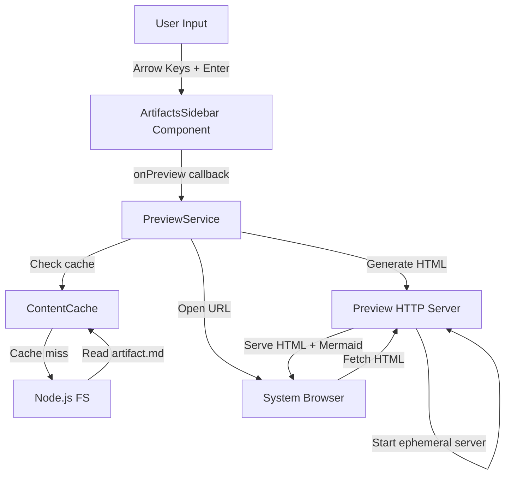
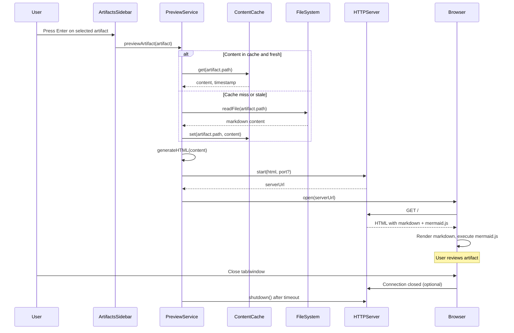
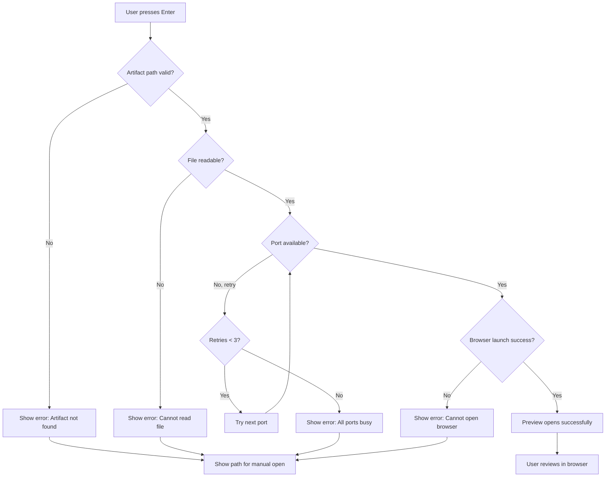
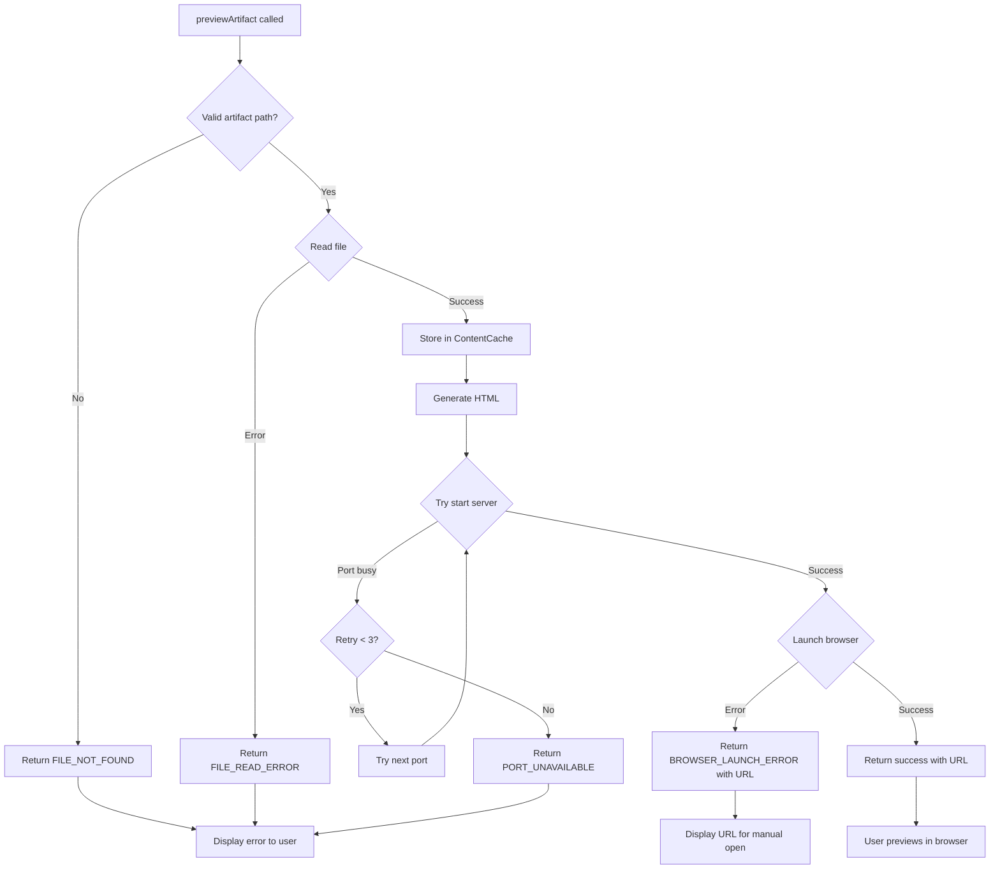

# Technical Design: Artifact Preview

## Overview

This feature enables users to preview artifact content (specifications, design documents, task lists) directly from the terminal CLI by selecting artifacts in the ArtifactsSidebar. The preview opens in a browser window with formatted markdown rendering and visual Mermaid diagrams, providing a rich reading experience without leaving the CLI workflow.

**Purpose**: Provide instant, formatted preview of generated artifacts to facilitate review and approval during spec-driven development.

**Users**: Developers using the red64-cli tool will utilize this for reviewing generated specifications, designs, and task breakdowns during the interactive CLI workflow.

**Impact**: Enhances the current static artifact display by adding interactive selection and rich preview capabilities, transforming the ArtifactsSidebar from a reference list into an actionable navigation interface.

### Goals
- Enable artifact selection and preview from ArtifactsSidebar using keyboard navigation
- Render markdown content with proper formatting and GitHub-style appearance
- Display Mermaid diagrams as visual SVG graphics in browser preview
- Provide responsive user experience with loading states and error handling
- Support cross-platform operation (macOS, Linux, Windows)
- Cache artifact content to avoid redundant file reads

### Non-Goals
- In-terminal markdown rendering (deferred to Phase 2)
- Editing artifacts from preview (read-only view only)
- Real-time collaborative preview or live file watching
- Custom theming or preview layout customization
- Printing or exporting preview content
- Multiple simultaneous artifact previews

## Architecture

### Existing Architecture Analysis

The red64-cli application is built using Ink (React for CLIs) with the following relevant patterns:

- **Component Architecture**: Functional React components with TypeScript strict mode
- **State Management**: Local component state (useState) for UI interactions; flow state persisted to JSON files
- **File Operations**: Node.js fs/promises for reading markdown artifacts
- **Service Layer**: Dedicated services (e.g., TemplateService) for file system operations
- **Type System**: Strict TypeScript with discriminated unions for state machines
- **Artifact Tracking**: Artifact interface tracks generated files (name, filename, path, phase, createdAt)

Current ArtifactsSidebar is presentational-only with no interactivity. This feature adds:
- Keyboard input handling for artifact selection
- Preview service for rendering and launching browser
- HTTP server for serving markdown as HTML
- Content caching layer for performance

### Architecture Pattern & Boundary Map

**Selected Pattern**: Service-Oriented Architecture with Component-Driven UI

The architecture introduces clear boundaries between UI interaction (Ink components), business logic (preview orchestration service), and external integration (HTTP server, browser launcher).



**Architecture Integration**:
- **Selected pattern**: Service-Oriented with clear separation of concerns (UI ↔ Service ↔ External Systems)
- **Domain/feature boundaries**:
  - **UI Layer**: ArtifactsSidebar owns artifact selection state and keyboard interaction
  - **Service Layer**: PreviewService orchestrates preview lifecycle (read → cache → serve → open)
  - **Cache Layer**: ContentCache manages artifact content with TTL
  - **Server Layer**: PreviewHTTPServer manages ephemeral HTTP server lifecycle
- **Existing patterns preserved**: Service layer pattern (TemplateService), TypeScript strict types, functional components
- **New components rationale**:
  - PreviewService: Prevents UI components from knowing about browsers/servers
  - ContentCache: Centralizes caching logic per Requirement 8.3
  - PreviewHTTPServer: Isolates HTTP server lifecycle from preview orchestration
- **Steering compliance**: Follows service layer separation, TypeScript strict mode, and functional component patterns

### Technology Stack

| Layer | Choice / Version | Role in Feature | Notes |
|-------|------------------|-----------------|-------|
| **CLI Framework** | Ink 5.x | Terminal UI rendering, keyboard input handling | Existing; React renderer for CLIs |
| **Runtime** | Node.js 20+ | File system access, HTTP server, process spawning | Existing |
| **Language** | TypeScript 5.x (strict) | Type-safe interfaces, error prevention | Existing; strict mode enabled |
| **Markdown Parser** | marked 14.1.3 | Convert markdown to HTML for browser preview | New dependency |
| **Markdown Styling** | github-markdown-css 5.7.0 | GitHub-style CSS for HTML preview | New dependency |
| **Diagram Rendering** | mermaid.js 11.4.1 | Client-side SVG rendering in browser | New dependency (client-side) |
| **Browser Launcher** | open 11.0.0 | Cross-platform browser opening | New dependency |
| **HTTP Server** | Node.js http (built-in) | Serve HTML to browser | Existing built-in |
| **Content Caching** | JavaScript Map (built-in) | In-memory cache with TTL | No external dependency |

**Rationale**:
- **marked**: Industry standard (12,730+ dependents), powers marked-terminal, stable and fast
- **github-markdown-css**: Provides familiar GitHub styling for technical documentation
- **mermaid.js**: Official Mermaid library, client-side rendering eliminates server complexity
- **open**: 12,730+ dependents, maintained by Sindre Sorhus, most reliable cross-platform launcher
- **Node.js http**: Built-in, sufficient for ephemeral single-use server, no framework overhead

## System Flows

### Preview Artifact Flow

User selects an artifact from the sidebar to trigger browser preview. The system reads the file, caches content, starts an ephemeral HTTP server, and opens the browser.



**Flow-level decisions**:
- Cache check first: Avoids file I/O for repeated previews of same artifact
- Ephemeral server: Started on-demand, auto-shutdown after inactivity (60s timeout) or process exit
- Port selection: Random port in range 3000-3999 with availability check
- Graceful shutdown: HTTP server closes connections and exits cleanly

### Error Handling Flow

System handles file read failures, port conflicts, and browser launch errors with user-friendly messages.



**Gating conditions**:
- File path validity checked before read attempt
- Port availability verified before server start (3 retries with different ports)
- Browser launch errors caught and user notified with manual fallback

## Requirements Traceability

| Requirement | Summary | Components | Interfaces | Flows |
|-------------|---------|------------|------------|-------|
| 1.1 | Click artifact triggers preview | ArtifactsSidebar | onPreview callback | Preview Artifact Flow |
| 1.2 | Keyboard Enter/Space opens preview | ArtifactsSidebar | useInput hook (Ink) | Preview Artifact Flow |
| 1.3 | ARIA attributes for accessibility | ArtifactsSidebar | N/A (terminal context) | N/A |
| 1.4 | Loading indicator during load | PreviewService | N/A (instant in terminal) | N/A |
| 1.5 | Error message if not found | PreviewService | Error handling | Error Handling Flow |
| 1.6 | Hover/focus states | ArtifactsSidebar | Visual highlighting | N/A |
| 2.1, 2.2, 2.3, 2.4, 2.5, 2.6, 2.7, 2.8 | Markdown rendering (headings, lists, code, links, emphasis, blockquotes, line breaks, paragraphs) | PreviewHTMLGenerator | marked library API | Preview Artifact Flow |
| 3.1 | Render Mermaid code blocks | PreviewHTMLGenerator | mermaid.js script tag | Preview Artifact Flow |
| 3.2 | Support common diagram types | mermaid.js (client) | N/A | N/A |
| 3.3 | Error message on diagram failure | mermaid.js (client) | N/A | Error Handling Flow |
| 3.4 | Diagram sized to fit window | github-markdown-css | CSS styling | N/A |
| 3.5 | Consistent theme styling | github-markdown-css | CSS styling | N/A |
| 4.1 | Preview opens as new window | open library | Browser API | Preview Artifact Flow |
| 4.2 | Visible close button | Browser native | Browser UI | N/A |
| 4.3 | Close button closes window | Browser native | Browser UI | N/A |
| 4.4 | Escape key closes window | Browser native | Browser UI | N/A |
| 4.5 | Focus returns to CLI | N/A (browser independent) | N/A | N/A |
| 4.6 | Title indicates artifact | PreviewHTMLGenerator | HTML title tag | Preview Artifact Flow |
| 5.1 | Loading spinner | N/A (instant for CLI) | N/A | N/A |
| 5.2 | Network error message | PreviewService | Error handling | Error Handling Flow |
| 5.3 | Invalid path error | PreviewService | Error handling | Error Handling Flow |
| 5.4 | Smooth transition | N/A (browser native) | N/A | N/A |
| 5.5 | Retry button on error | N/A (user re-selects) | N/A | N/A |
| 6.1, 6.2, 6.3, 6.4, 6.5, 6.6, 6.7, 6.8 | Responsive layout, mobile/desktop optimization, scrolling, ARIA roles, focus management, keyboard access, WCAG contrast | github-markdown-css, Browser native | CSS, Semantic HTML | N/A |
| 7.1, 7.2, 7.3 | Window dimensions, positioning, background scroll prevention | N/A (browser default) | N/A | N/A |
| 7.4 | Replace content on new artifact | HTTPServer | Server state | Preview Artifact Flow |
| 7.5 | Remember scroll position | N/A (not MVP) | N/A | N/A |
| 8.1 | Render within 300ms | Browser native | N/A | N/A |
| 8.2 | Code splitting (Mermaid lazy load) | N/A (client-side lib) | N/A | N/A |
| 8.3 | Cache content 5 minutes | ContentCache | Cache API | Preview Artifact Flow |
| 8.4 | Responsive for large files | Browser native | N/A | N/A |
| 8.5 | Lazy-load Mermaid diagrams | N/A (not MVP) | N/A | N/A |

## Components and Interfaces

### Component Summary

| Component | Domain/Layer | Intent | Req Coverage | Key Dependencies (P0/P1) | Contracts |
|-----------|--------------|--------|--------------|--------------------------|-----------|
| ArtifactsSidebar | UI / Presentation | Display artifacts with keyboard selection | 1.1, 1.2, 1.6 | Ink Box/Text (P0), useInput (P0) | Callback |
| PreviewService | Service / Orchestration | Coordinate preview lifecycle (read → serve → open) | 1.4, 1.5, 5.2, 5.3, 8.3 | ContentCache (P0), PreviewHTMLGenerator (P0), PreviewHTTPServer (P0), open (P0) | Service |
| ContentCache | Service / Caching | Store artifact content with TTL | 8.3 | None | Service |
| PreviewHTMLGenerator | Service / Transformation | Convert markdown to HTML with Mermaid | 2.1, 2.2, 2.3, 2.4, 2.5, 2.6, 2.7, 2.8, 3.1, 4.6 | marked (P0), github-markdown-css (P0) | Service |
| PreviewHTTPServer | Service / Integration | Manage ephemeral HTTP server | 7.4 | Node.js http (P0) | Service |

### UI Layer

#### ArtifactsSidebar

| Field | Detail |
|-------|--------|
| Intent | Display artifact list with keyboard navigation and selection for preview |
| Requirements | 1.1, 1.2, 1.6 |
| Owner / Reviewers | Core team |

**Responsibilities & Constraints**
- Display list of artifacts with visual styling (icons, colors)
- Handle keyboard input (Arrow Up/Down for navigation, Enter/Space to preview)
- Maintain selected artifact index in local state
- Invoke preview callback when user confirms selection
- Provide visual feedback for selected/focused artifact
- Domain boundary: UI presentation only; delegates preview logic to parent/service

**Dependencies**
- Inbound: StartScreen provides artifacts array and worktreePath (P0)
- Outbound: PreviewService for preview execution (P0)
- External: Ink Box/Text/useInput for rendering and keyboard handling (P0)

**Contracts**: Callback [X]

##### Callback Interface
```typescript
interface ArtifactsSidebarProps {
  readonly artifacts: readonly Artifact[];
  readonly worktreePath: string | null;
  readonly onPreview?: (artifact: Artifact) => void;
}

interface Artifact {
  readonly name: string;
  readonly filename: string;
  readonly path: string;
  readonly phase: string;
  readonly createdAt: string;
}
```

**Implementation Notes**
- Integration: Extend existing ArtifactsSidebar component with useInput hook for keyboard handling
- Validation: Selected index clamped to valid range [0, artifacts.length-1]
- Risks: useInput may capture input globally; ensure proper focus management

### Service Layer

#### PreviewService

| Field | Detail |
|-------|--------|
| Intent | Orchestrate artifact preview lifecycle: read file, cache, generate HTML, start server, open browser |
| Requirements | 1.4, 1.5, 5.2, 5.3, 8.3 |
| Owner / Reviewers | Core team |

**Responsibilities & Constraints**
- Check ContentCache for artifact content, read from filesystem if miss/stale
- Delegate HTML generation to PreviewHTMLGenerator
- Manage PreviewHTTPServer lifecycle (start, track, shutdown)
- Launch browser using open library
- Handle errors gracefully (file not found, port busy, browser launch failure)
- Domain boundary: Orchestration only; does not render HTML or manage HTTP connections directly

**Dependencies**
- Inbound: ArtifactsSidebar triggers preview via callback (P0)
- Outbound: ContentCache for content retrieval (P0), PreviewHTMLGenerator for HTML (P0), PreviewHTTPServer for serving (P0), open library for browser (P0)
- External: Node.js fs/promises for file reading (P0)

**Contracts**: Service [X]

##### Service Interface
```typescript
interface PreviewServiceInterface {
  /**
   * Preview artifact in browser
   * @param artifact - Artifact to preview
   * @returns Result with success status and optional error
   */
  previewArtifact(artifact: Artifact): Promise<PreviewResult>;

  /**
   * Shutdown all active preview servers (cleanup)
   */
  shutdownAll(): Promise<void>;
}

type PreviewResult =
  | { readonly success: true; readonly url: string }
  | { readonly success: false; readonly error: PreviewError };

interface PreviewError {
  readonly code: PreviewErrorCode;
  readonly message: string;
  readonly details?: string;
}

type PreviewErrorCode =
  | 'FILE_NOT_FOUND'
  | 'FILE_READ_ERROR'
  | 'PORT_UNAVAILABLE'
  | 'BROWSER_LAUNCH_ERROR'
  | 'UNKNOWN';
```

- **Preconditions**: Artifact must have valid path property
- **Postconditions**: On success, browser opens with rendered content; HTTP server running; entry added to ContentCache. On failure, error returned and no side effects.
- **Invariants**: At most one HTTP server per artifact preview; server auto-shutdown after 60s inactivity

**Implementation Notes**
- Integration: Instantiated as singleton in StartScreen or App component
- Validation: Check artifact.path is absolute and within worktree bounds
- Risks: Port conflicts in multi-user environments; browser not installed (Docker sandbox)

#### ContentCache

| Field | Detail |
|-------|--------|
| Intent | In-memory cache for artifact file content with 5-minute TTL |
| Requirements | 8.3 |
| Owner / Reviewers | Core team |

**Responsibilities & Constraints**
- Store artifact content keyed by file path
- Track timestamp for each entry
- Automatically invalidate entries older than 5 minutes (300,000 ms)
- Domain boundary: Pure caching logic; no file I/O or knowledge of artifact structure

**Dependencies**
- Inbound: PreviewService reads/writes cache entries (P0)
- Outbound: None
- External: None (uses JavaScript Map)

**Contracts**: Service [X]

##### Service Interface
```typescript
interface ContentCacheInterface {
  /**
   * Get cached content if fresh (< 5 minutes old)
   * @param filePath - Absolute path to artifact file
   * @returns Cached content or null if miss/stale
   */
  get(filePath: string): string | null;

  /**
   * Store content in cache with current timestamp
   * @param filePath - Absolute path to artifact file
   * @param content - File content to cache
   */
  set(filePath: string, content: string): void;

  /**
   * Clear all cache entries
   */
  clear(): void;

  /**
   * Remove stale entries (> 5 minutes old)
   */
  prune(): void;
}

interface CacheEntry {
  readonly content: string;
  readonly timestamp: number;
}
```

- **Preconditions**: filePath must be non-empty string
- **Postconditions**: get returns null if entry stale or missing; set always succeeds; prune removes expired entries
- **Invariants**: TTL is 300,000 ms (5 minutes); timestamps are Unix epoch milliseconds

**Implementation Notes**
- Integration: Singleton instance passed to PreviewService
- Validation: prune() called on every get() to avoid memory leaks
- Risks: Memory growth if many large files cached; mitigated by TTL and prune()

#### PreviewHTMLGenerator

| Field | Detail |
|-------|--------|
| Intent | Transform markdown content to HTML with GitHub styling and Mermaid support |
| Requirements | 2.1, 2.2, 2.3, 2.4, 2.5, 2.6, 2.7, 2.8, 3.1, 4.6 |
| Owner / Reviewers | Core team |

**Responsibilities & Constraints**
- Parse markdown to HTML using marked library
- Inject github-markdown-css for styling
- Include mermaid.js script tag for client-side diagram rendering
- Set HTML title to artifact name
- Wrap content in semantic HTML5 structure
- Domain boundary: Pure transformation; no file I/O or server logic

**Dependencies**
- Inbound: PreviewService provides markdown content and artifact metadata (P0)
- Outbound: None
- External: marked library for parsing (P0), github-markdown-css for styling (P0), mermaid.js CDN URL (P0)

**Contracts**: Service [X]

##### Service Interface
```typescript
interface PreviewHTMLGeneratorInterface {
  /**
   * Generate complete HTML document from markdown content
   * @param content - Raw markdown string
   * @param title - Artifact name for HTML title
   * @returns Complete HTML document string
   */
  generateHTML(content: string, title: string): string;
}
```

- **Preconditions**: content is valid UTF-8 string (may be empty)
- **Postconditions**: Returns valid HTML5 document; mermaid code blocks preserved for client-side rendering
- **Invariants**: HTML always includes github-markdown-css and mermaid.js script; max-width 980px on desktop

**Implementation Notes**
- Integration: Stateless utility; can be pure function or class with no instance state
- Validation: marked library handles invalid markdown gracefully (no exceptions)
- Risks: CDN availability for github-markdown-css and mermaid.js; fallback to inline styles if needed

#### PreviewHTTPServer

| Field | Detail |
|-------|--------|
| Intent | Manage ephemeral HTTP server lifecycle for serving preview HTML |
| Requirements | 7.4 |
| Owner / Reviewers | Core team |

**Responsibilities & Constraints**
- Start HTTP server on random available port (3000-3999 range)
- Serve HTML content on GET / request
- Auto-shutdown after 60 seconds of inactivity or on explicit shutdown call
- Track active server instances to prevent port leaks
- Domain boundary: HTTP server lifecycle only; does not generate HTML

**Dependencies**
- Inbound: PreviewService starts/stops server (P0)
- Outbound: None
- External: Node.js http module (P0)

**Contracts**: Service [X]

##### Service Interface
```typescript
interface PreviewHTTPServerInterface {
  /**
   * Start ephemeral HTTP server on random available port
   * @param html - HTML content to serve
   * @param preferredPort - Optional preferred port (default: random 3000-3999)
   * @returns Server URL (http://localhost:PORT) or error
   */
  start(html: string, preferredPort?: number): Promise<ServerStartResult>;

  /**
   * Shutdown specific server instance
   * @param url - Server URL returned from start()
   */
  shutdown(url: string): Promise<void>;

  /**
   * Shutdown all active server instances
   */
  shutdownAll(): Promise<void>;
}

type ServerStartResult =
  | { readonly success: true; readonly url: string; readonly port: number }
  | { readonly success: false; readonly error: string };
```

- **Preconditions**: html is non-empty string; port (if provided) is 1-65535
- **Postconditions**: On success, HTTP server listening on returned URL; server auto-shutdown after 60s. On failure, no server running.
- **Invariants**: Port selection tries up to 3 random ports if unavailable; server always responds with Content-Type: text/html

**Implementation Notes**
- Integration: Singleton instance passed to PreviewService
- Validation: Check port availability before binding with net.Server.listen error handling
- Risks: Port exhaustion if many previews opened rapidly; orphaned servers if process crashes (mitigated by auto-shutdown timeout)

## Data Models

### Domain Model

**Aggregates and Boundaries**:
- **Artifact Aggregate**: Artifact entity (existing type) represents generated documentation file with metadata
- **Preview Session**: Transient aggregate encompassing cache entry, HTTP server instance, and browser process (not persisted)

**Entities**:
- **Artifact** (existing): Immutable entity with file path, name, phase, timestamp
- **CacheEntry**: Value object with content and timestamp

**Domain Events**:
- PreviewRequested: User selects artifact
- ContentCached: Artifact content stored in cache
- ServerStarted: HTTP server begins listening
- BrowserOpened: Browser process launched
- PreviewCompleted: User closes browser (implicit)

**Business Rules**:
- Artifact path must exist in filesystem before preview
- Cache entries expire after 5 minutes
- HTTP server must shutdown if unused for 60 seconds
- Only one HTTP server per preview session

**Invariants**:
- Artifact.path is always absolute path within worktree
- CacheEntry.timestamp is Unix epoch milliseconds
- HTTP server port is always in range 1-65535

### Logical Data Model

**Structure Definition**:
```typescript
interface PreviewSession {
  readonly artifact: Artifact;
  readonly serverUrl: string;
  readonly serverPort: number;
  readonly startedAt: Date;
}

interface CacheEntry {
  readonly content: string;
  readonly timestamp: number;
}

type ContentCacheMap = Map<string, CacheEntry>;
type ActiveServersMap = Map<string, http.Server>;
```

**Consistency & Integrity**:
- **Transaction boundaries**: Preview operation is single transaction (read file → cache → start server → open browser); no partial state exposed
- **Referential integrity**: Cache keys match Artifact.path exactly; server URLs unique per instance
- **Temporal aspects**: CacheEntry.timestamp for TTL; PreviewSession.startedAt for server timeout

### Physical Data Model

No persistent storage. All data stored in memory (JavaScript Map) during process lifetime.

**In-Memory Structures**:
- ContentCache: Map<string, { content: string; timestamp: number }>
- ActiveServers: Map<string, http.Server>

**Cleanup Strategy**:
- ContentCache pruned on every get() call to remove stale entries
- HTTP servers auto-shutdown after 60s timeout using Node.js setTimeout
- All resources released on process exit (no explicit persistence)

## Error Handling

### Error Strategy

Use discriminated union types for error results. Return structured errors instead of throwing exceptions to maintain control flow clarity in async operations.

### Error Categories and Responses

**User Errors (File/Path Issues)**:
- **FILE_NOT_FOUND**: Artifact file doesn't exist at specified path
  - Response: Display error in terminal: "Artifact not found: {path}". Suggest checking artifact list.
  - Recovery: User can select different artifact; no retry logic needed

- **FILE_READ_ERROR**: Permission denied or I/O error reading file
  - Response: Display error: "Cannot read artifact: {path}. Check permissions."
  - Recovery: User can fix permissions or select different artifact

**System Errors (Infrastructure)**:
- **PORT_UNAVAILABLE**: All attempted ports (3 retries) are busy
  - Response: Display error: "Cannot start preview server. All ports busy. Please close other applications."
  - Recovery: User can retry after closing conflicting services; no automatic retry

- **BROWSER_LAUNCH_ERROR**: Failed to launch browser (not installed, sandbox mode)
  - Response: Display error: "Cannot open browser. Preview available at: {url}. Copy URL to browser."
  - Recovery: User can manually open URL; provide fallback message with path

**Business Logic Errors**: None (read-only preview operation)

### Error Flow



### Monitoring

- **Error Logging**: All errors logged to stderr with context (artifact path, error code, timestamp)
- **Health Monitoring**: Track active server count (should be 0-1 in typical use); log warning if > 3
- **Performance Metrics**: Cache hit rate (hits / (hits + misses)); log if < 50% (indicates TTL too short)

## Testing Strategy

### Unit Tests
- **PreviewService.previewArtifact**: Mock ContentCache, PreviewHTMLGenerator, PreviewHTTPServer, open; verify orchestration logic
- **ContentCache.get/set/prune**: Test TTL expiration, cache miss, cache hit, prune removes stale entries
- **PreviewHTMLGenerator.generateHTML**: Test markdown parsing (headings, lists, code blocks), Mermaid code block preservation, HTML structure
- **PreviewHTTPServer.start**: Test port availability check, retry logic, server binding, shutdown timeout

### Integration Tests
- **Full preview flow**: Real file system → ContentCache → PreviewHTMLGenerator → PreviewHTTPServer → verify HTTP response
- **Cache integration**: Read same file twice, verify second read from cache (no file I/O)
- **Port conflict handling**: Start server on port, start second server, verify second uses different port
- **Error propagation**: Delete artifact file between reads, verify FILE_NOT_FOUND error bubbles up

### E2E/UI Tests
- **Keyboard navigation**: Render ArtifactsSidebar, press Arrow Down, verify selection moves
- **Preview trigger**: Render ArtifactsSidebar with mock onPreview, press Enter, verify callback invoked
- **Error display**: Trigger FILE_NOT_FOUND error, verify error message displayed in terminal UI

### Performance/Load
- **Large file handling**: Preview 1MB markdown file, verify render < 300ms
- **Cache memory usage**: Cache 10 large files (100KB each), verify memory < 10MB
- **Concurrent previews**: Open 5 previews simultaneously, verify all succeed without port conflicts
- **Server cleanup**: Start 10 servers, wait 60s, verify all auto-shutdown

## Security Considerations

**Path Traversal Prevention**:
- Validate artifact.path is within worktree bounds before reading
- Use path.resolve() to canonicalize paths and detect ../.. attacks
- Reject paths containing null bytes or invalid characters

**Content Injection**:
- HTML generated from markdown is safe (marked library escapes HTML by default)
- Mermaid.js runs in browser sandbox; no server-side code execution
- No user-provided HTML accepted; only markdown source

**HTTP Server Security**:
- Server binds to localhost only (127.0.0.1), not accessible from network
- No authentication required (local access only)
- Auto-shutdown prevents long-lived servers from becoming attack vector

**Dependency Security**:
- Use npm audit to check for vulnerabilities in marked, open, mermaid.js
- Pin dependency versions to avoid supply chain attacks
- github-markdown-css and mermaid.js loaded from CDN (jsDelivr or unpkg) with SRI hashes (future enhancement)

## Performance & Scalability

**Target Metrics**:
- Preview open (file read → browser launch): < 500ms for typical artifact (< 100KB)
- Cache hit: < 10ms to retrieve content
- HTML generation: < 50ms for markdown parsing
- HTTP server start: < 100ms for port binding

**Optimization Techniques**:
- In-memory cache eliminates redundant file I/O (5-minute TTL)
- Ephemeral HTTP server avoids port management overhead of long-lived servers
- Client-side Mermaid rendering offloads diagram processing to browser
- github-markdown-css loaded from CDN leverages browser cache

**Scalability Considerations**:
- Cache memory bounded by TTL (5 minutes) and artifact count (typically < 10)
- HTTP server count bounded by concurrent previews (typically 1, max ~5)
- No shared state between preview sessions; horizontally scalable (not applicable for single-user CLI)

**Performance Monitoring**:
- Log preview operation timing (file read, HTML gen, server start, browser launch)
- Track cache hit rate; adjust TTL if < 50%
- Alert if server count > 3 (indicates cleanup failure)
